# trade-release

## Assignment for Class 10
**Completion Date:** Nov 10

1. **Asynchronisation of seconds orders**:
  
   - **Ceate order message configuration**:
   In this part, we first modify the `RabbitMqConfig` to create the normal order queue for receive the order request and bidning it with the order status check to the exchanger. Then we modify the `OrderMessangeSensder` to first send the order message to the `to.create.order` queue and then utilize the 'sendpaystatusCheckDelayMessage' to send the message to another `order.create` queue to check for the order payment stauts. 

   - **Order Create logic modification**:
   For this part, we modify the `CreateOrder` function and instead of using `OrderDao` to insertOrder directly, we just first call the order message sender to send create order message and then return. Finally we create the createorderReceiver to process the newely created order and call the `orderMessageSender` to send the order status check message. We also conductedd the order create test:
   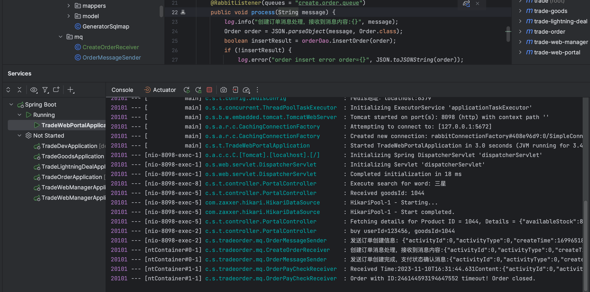
   As shown in the above image, the order experience the create order message process, checking the order creation of the sending order and send the payment status checking message. The message is received correctly, and after timeout, the order will closed and the corresponding message log will prompted. 
 
2. **Limit Buy**:

I apply Redis solution to put the flash sale request coming and judge whether the userid sets exists or not, if yes, we cannot buy the goods, if not then we create the order and deduct the stock using, `sadd` to add key member to the set key. Finally, if we do not process the payment successfully, we will also remove the userId. 

1. LimitBuy Service Implementation:

I add the necessary dependency from `trade-order` into `trade-lightning-deal` module and move the redis config file into the `trade-order` module to ensure directional dependency. 
Then, I implemented limit buy service including add a member into the restrict purchase list, remove member and also check for whether the member is the the list or not. Then I implemented the Junit test for this function and it is verfied that all the functionality is good:

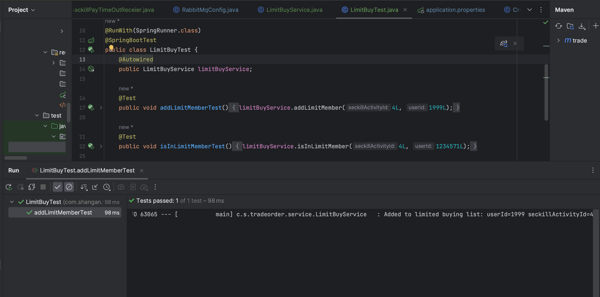

The above shows we can add a user into the limited user lists.

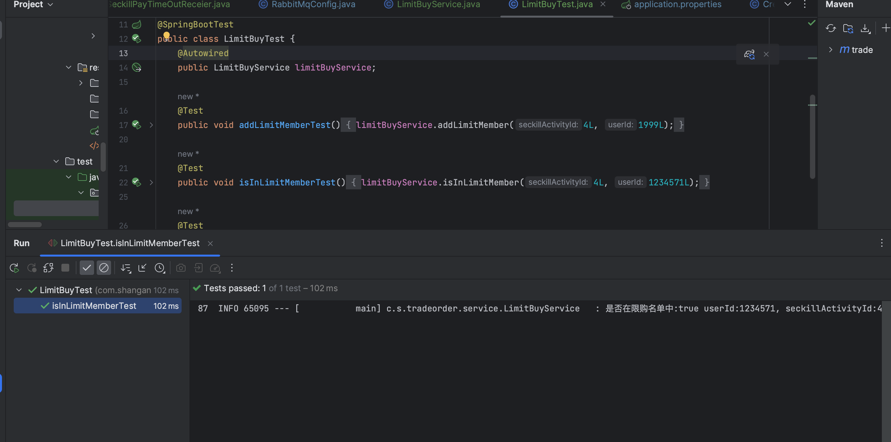

After added, we can vrify it is indeed there.

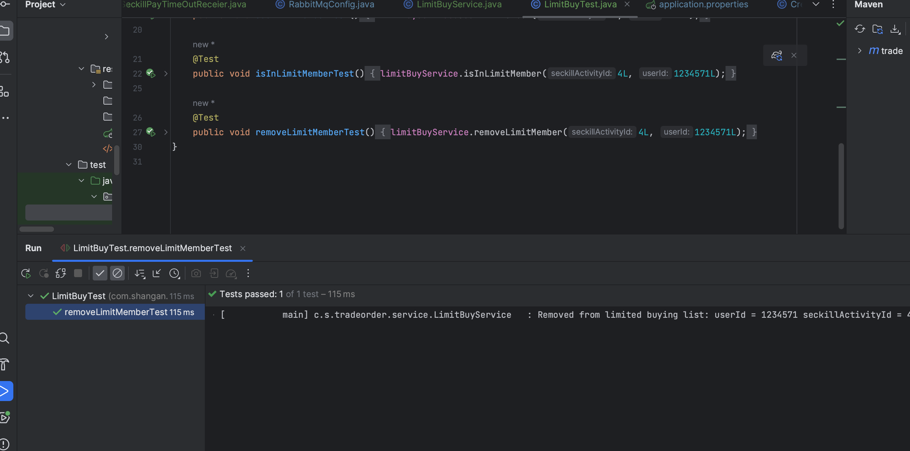
We can also remove the user from the user list by calling the 'removeLimitMember' method for limitbuyservice

After this, when we check again for the isInLimitMemberTest:
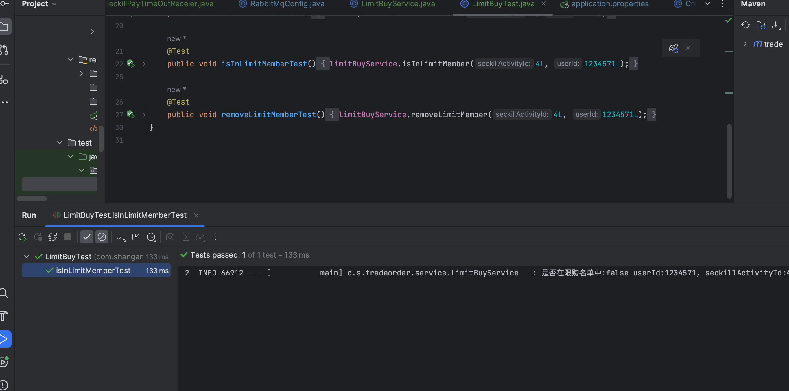
Then, we can find that now the user with Id:'1234571' is no longer in the limited list anymore hence our code functions well. 

3. **Oversell Overall Functionality Implementation**:

- **Creat order implementation**:

For this part, firstly, we deal with the creat order part, we modify the `CreatOrderReceiver` to add the user into the limit purchase list. 

- **Seckill process implementation**:

(1): Stock operaion:

In this part, we first update the stock `SeckillActivityMapper.xml` to enable opeations including lockstock, deduct stock and reverse stock and then we also implement these methods in `SeckillActivityService` to enable the seckill activity has these necessary functions related to the order and the storage. 

(2): Limit on purchasing calibration

In this part, we continue modify the file `SeckillActivityImpl` to update the newely process seckill function that first verify whether the user has the purchase qualifications(is in the limit user list or not) then we using Redis's Lua to conduct the storage check. The third step is to check the corresponding seckill activity information before finally stock the storage and create the order. 

(3) Adding 'error.html':
We add the error error boosting page and update the portal controller to have a mapping in `/seckill/buy/{userid}/{seckillId}` format and we can see that once the user has already make the purchase and succesfully paid it, it will give the correspondiing information  mentioning this(will show in the final test part).

- **Payment Successfully**:

In this part we implement the necessary message asynchronous processing to difine the flash sale realted `seckillPaySucessQueue` and its corresponding binding methods. Regarding the message sending, we implement the method  `sendSeckillPaySucessMessage` to deal with the situation where the user sucessfully make their payment and push this to `seckill.order.pay.sucess` queue. Finally, regarding the original `payorder` method, we use a 'if-else' branch to handle two cases differently, if it is the normal goods, we still call `goodServices.deductStock(id)` but if it is for the seckill activity's goods, we will call our `Ordermessagesender` to send the seckillpaysucess message out. 

Message Receiving: For the message receiving we implemented a `SeckillPaySucessReceiver` in the trade-lightening module to deal with the message process when the payment for seckill is successfully

 **Payment Timeout and order close**:

 If the order does not being paid in the given time, we remove the user from the limited uerlist and revert the stock by utilizing the message asynchronous processing and using RabbitMQ to binding the same routing key into a unified queue and more than one queue can receie the same message(In our case: both the normal order check queue and the seckill order check queue will received the messages from the order-event-exchange).

 We define another queue called `seckillPayTimeCheQueue` and binding it to the central exchange to deal with the seckill order pay time out. 

 Regarding the message Receiving: we defined two paycheckreceiver one for the normal order to deal with only normal goods order similarly as previous and also one receiver called: `SeckillPayTimeOutReceiver` to only deal with the seckill paytime out message and conduct the functionality I introduced earlier: (1) Remove the user from the userLimited List (2) Revert the stock for the 'SeckillActivity' (3) Update the order status to closing. 

4. **Seckill Complete Process Test**:

For this part, I will test the whole process in three different cases:

For all the test we just test with the seckill activity '4' and for the same user with 'id' : 1234571

Our start situation is that for the activity id '4': 黑色星期五, we have 95 avaiable stock:

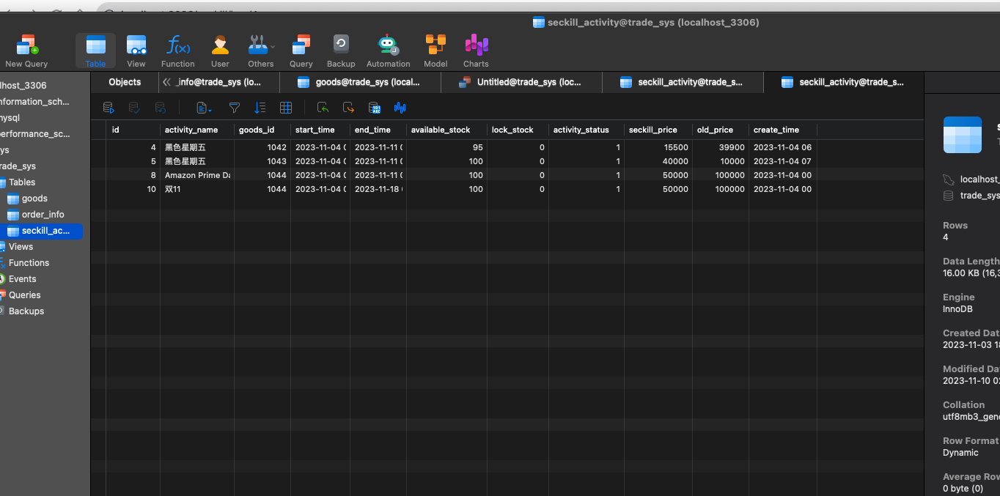

 **First Payment and immediate pay**:

 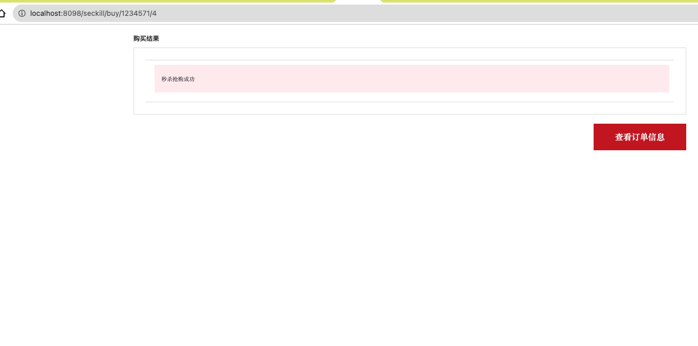
 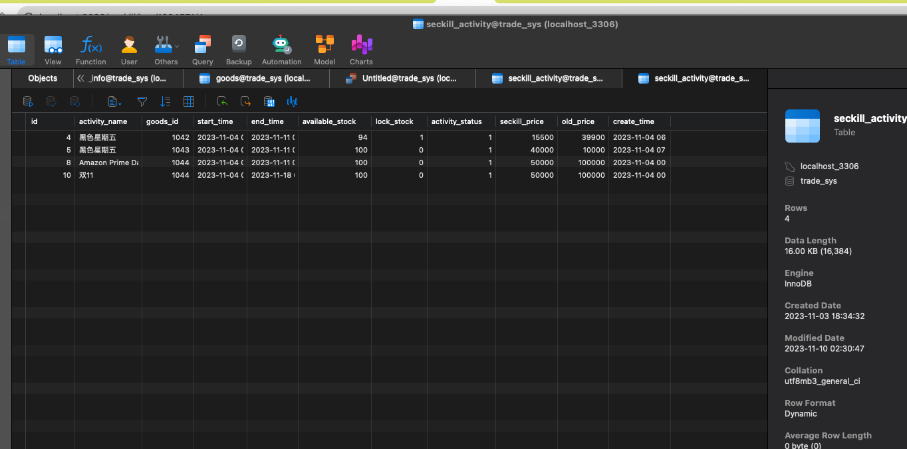
 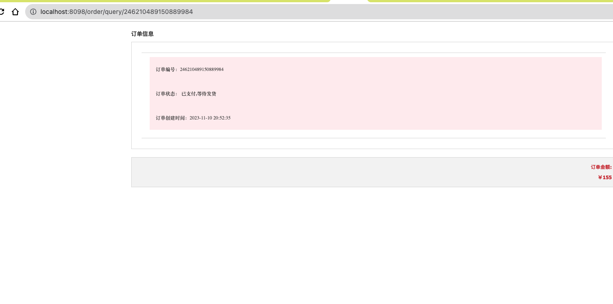
 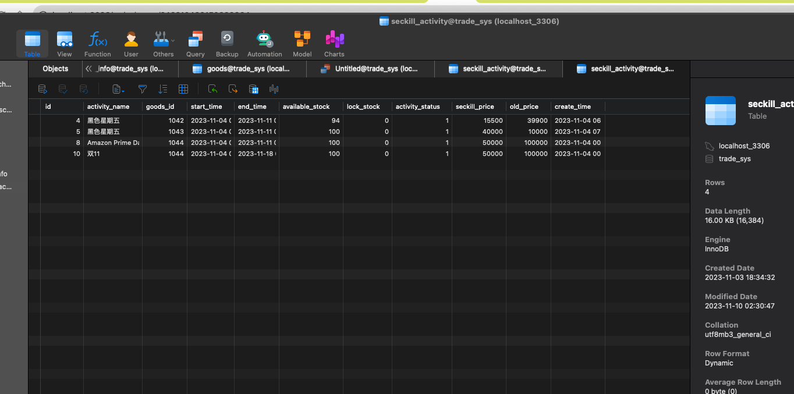
 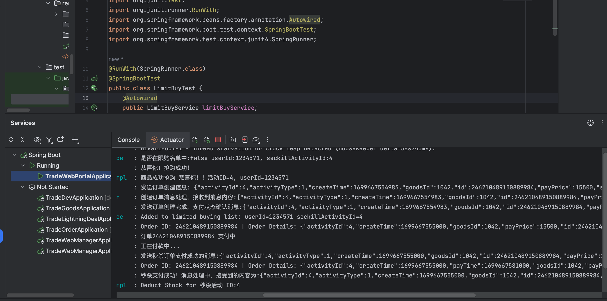

**First Payment and Order Payment Timeout**:
 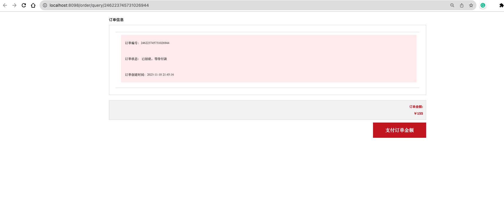
 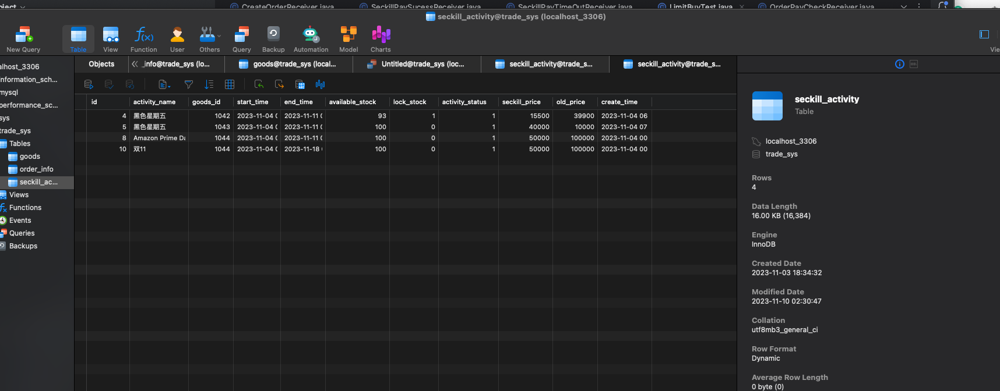
 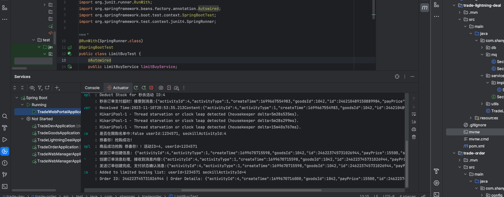
 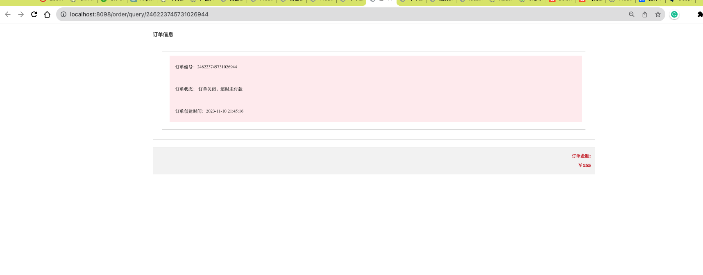
 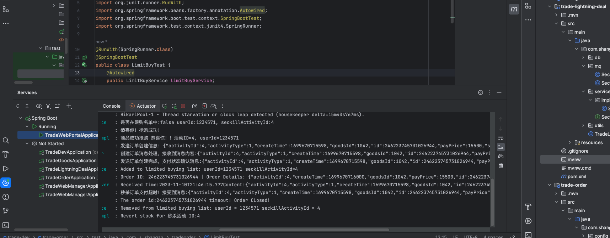
 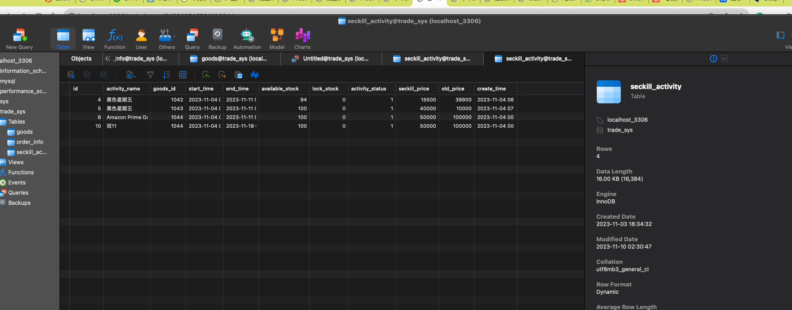

 **User Paid again**:
 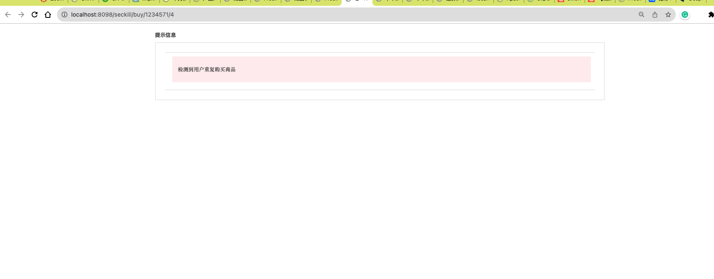
 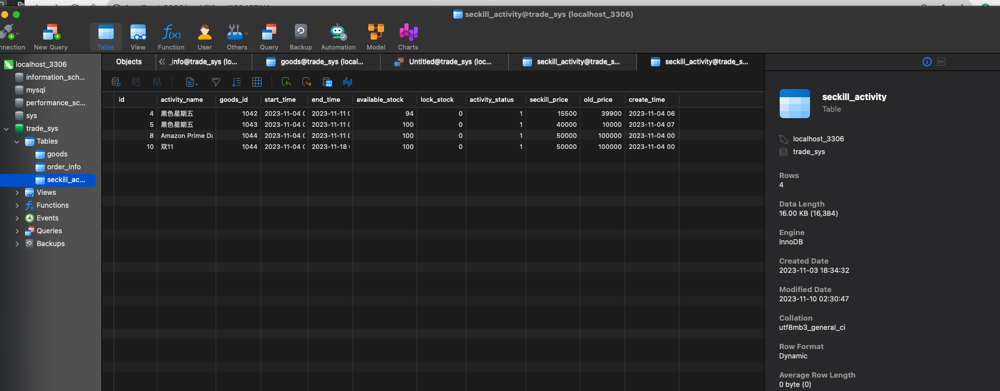

