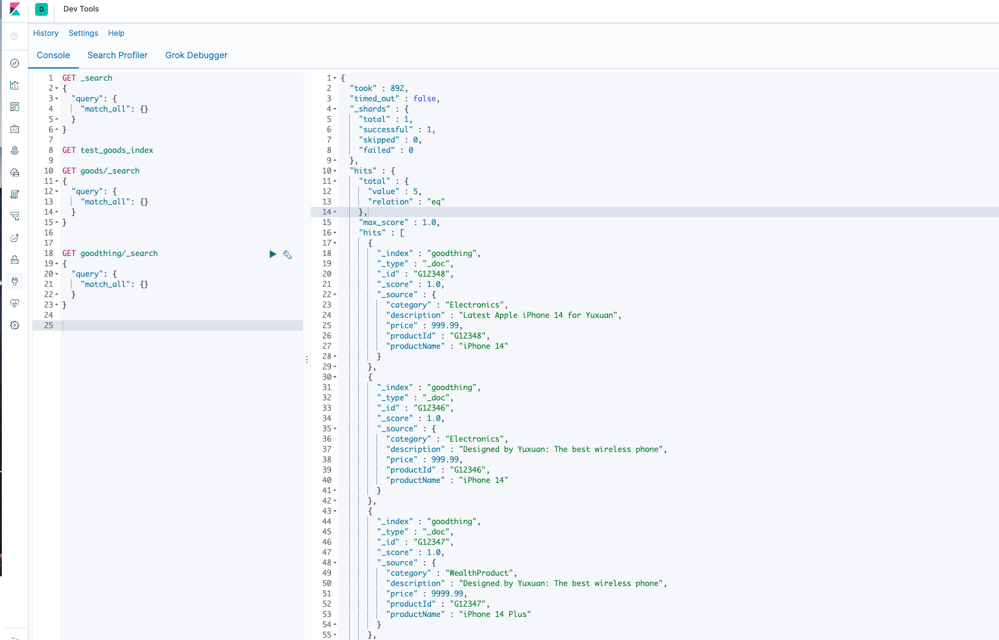
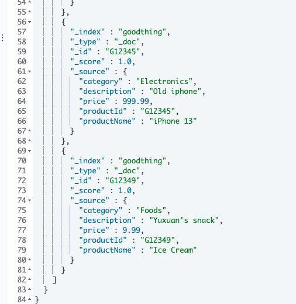
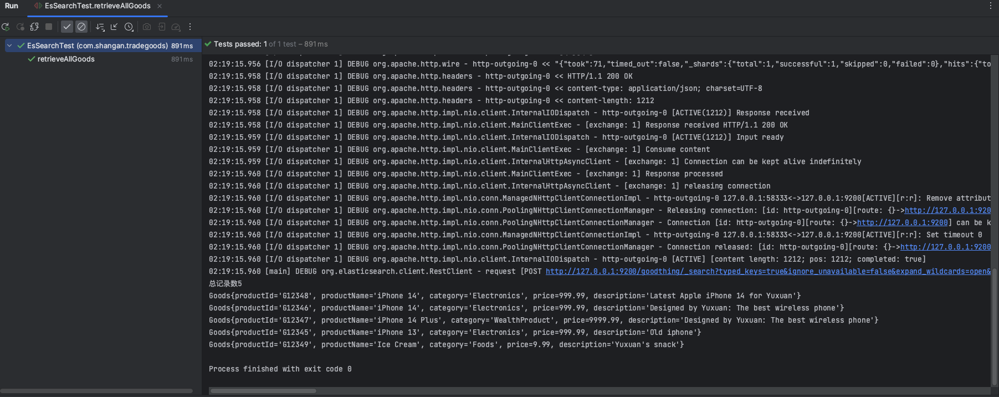
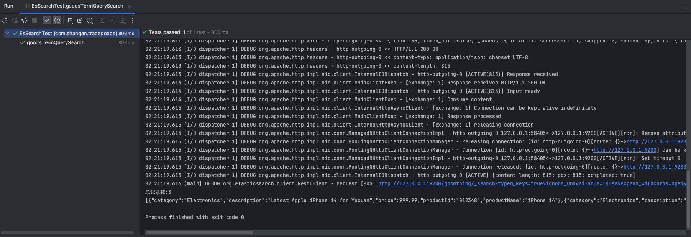
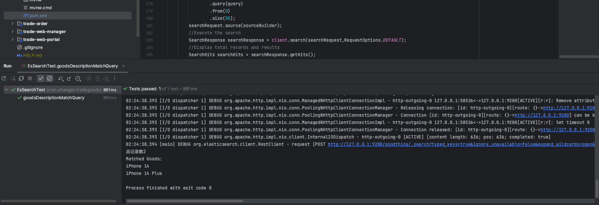
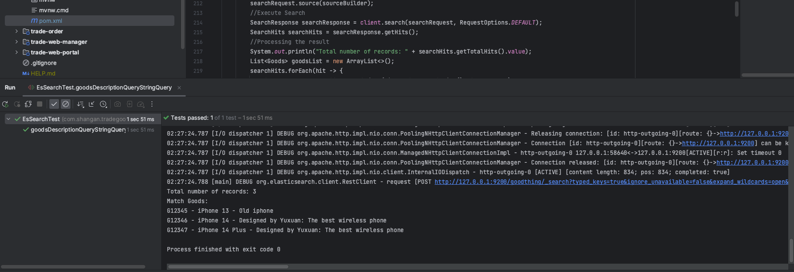
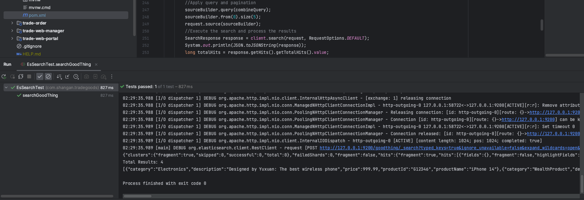
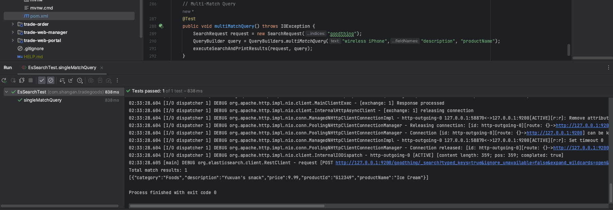
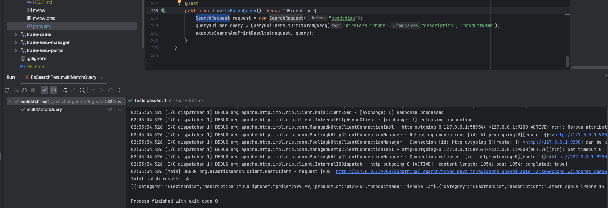

# trade-release

## Assignment 3 (Complete Data: Oct 20)

1. **Software Configuration**:
   - I have already downloaded ES(IK分词器) and Kibana
   - All the commands and unit test code are written myself
   - I have created specific git branch for this assignment(also for this readme)


2.  **Prerequisite: Establish IndexRequest and docs**:

     I have used self-writtend addGoodsDoc function to add some new products for the later testing process and those can be rechieved in the Kibana(by query "match_all"):
 


     


3.  **Testing**:

 **Test1: RetrieveAllGoods**: 

For this test, I just execute query match and it can be found all the 5 records are displayed:




  **Test2: goodsTermQuerySearch**: 
  For this test, I write code to search certain goods by their "category", in the chosen case:
  There are 3 prodcuts with category "Electronics" other two are "Food" and "Wealth Product" and the test result return 3 recrods successfully:

  

  **Test3: goodsDescriptionQuerySearch**: 

  For this test, we search for goods with descriptions with "wireless" to match goods based on certain criterian: 
  In my case, iPhone 14 and iPhone14 Plus has "wireless" in their product descripitons and we return two records correctly:
  

   **Test4: goodsDescriptionQueryStringQuery**: 

  For this test, I just using queryStringQuery format to choose certain products in different fields based on certain fields. In my case, I choose "decription" and "productName" and search for products contains "wireless or 13", there are 3 matched Goods shown as:
  

   **Test5: WildCardQuery**: 

   In this part, I create two wirecard with goods start with "wir" or "iph" and combine queries using a boolean OR condition and I apply query and pagination and found the results we have 4 records (except the goods for ice cream, all other goods all have some "wir" or "iph" in their description or product name fields):

   

   Finally, in order to general and simplify the repeated code for execute elastic search and print results, I write a private helper function to achieve this with the code:
   ```java
    private void executeSearchAndPrintResults(SearchRequest request, QueryBuilder query) throws IOException {
        SearchSourceBuilder sourceBuilder = new SearchSourceBuilder();
        sourceBuilder.query(query);
        sourceBuilder.from(0).size(10);
        request.source(sourceBuilder);
        //Execute the path
        SearchResponse response = client.search(request, RequestOptions.DEFAULT);
        //process the results
        long totalHits = response.getHits().getTotalHits().value;
        System.out.println("Total match results: " + totalHits);
        List<Goods> resultList = Arrays.stream(response.getHits().getHits())
                .map(hit->JSON.parseObject(hit.getSourceAsString(),Goods.class))
                .collect(Collectors.toList());
        System.out.println(JSON.toJSONString(resultList));
    }

   ```
   The final two additional test cases I executed using the helper function are:

   **Test6: SingleMatch Query**: 

   Just using 'matchQuery" to find the productname is icecream, from the below the image, the program returns the record for "Ice Cream" correctly:

   

   **Test7: MultiMatch Query**: 
   Just using the multimatchQuery format to search fore the text with: "wireless, iPhone" and "fieldNames in descriptions or productName:
   

   Again, the result shows 4 records which is consistent with the expectations.


