# trade-release

## Assignment for Class 13

### Rate Limiting and AWS Cloud Configuration(Optional)

**Completion Date:** Nov 30

1. **Implemntation Hystrix in the Project**:

I added necessary pom dependency into `trade-web-portal` module and add the annotation `@EnableCircuitBreaker` it is used to start the breaker and prevent that one service failed caused the entire service down. Then I configure the necessary configuration for the rate limiting and using the `SEMAPHORE` isolation strategy and set the maximum concurrency allowed to be 1. 

2. **Test for Rate Limiting**:

For this testing, I still use  `JMeter` to simulate the large concurrency request.  The configuration are:

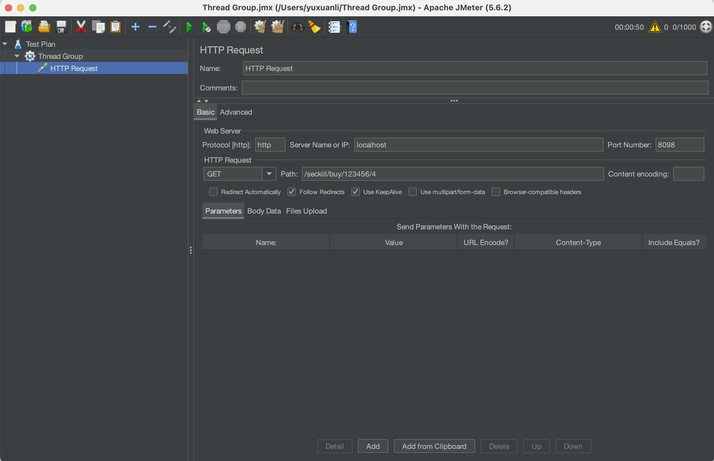

Then we test the corresponidng path from our application and can verify that the system indeed triggered the rate limiting: 
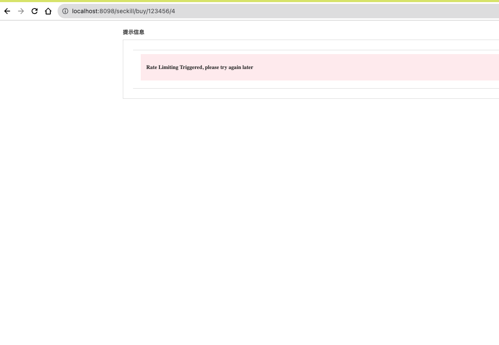
After the ramp-up period is expired, I also verifed that the system can continue to handle normal seckill buy request normally:
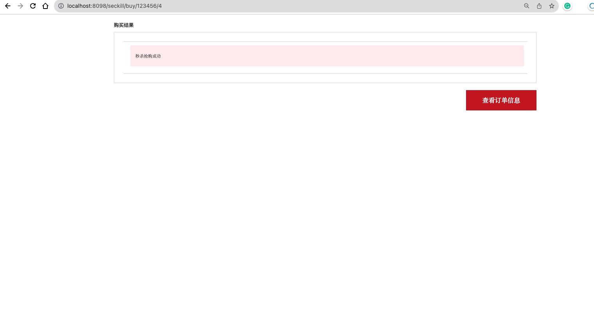

3. **AWS Cloud Configuration**:

For this part, I first create my EC2 instance in AWS, for the consideration of configure whole application into the cloud, I choose `t2.medium` as the instance type. 

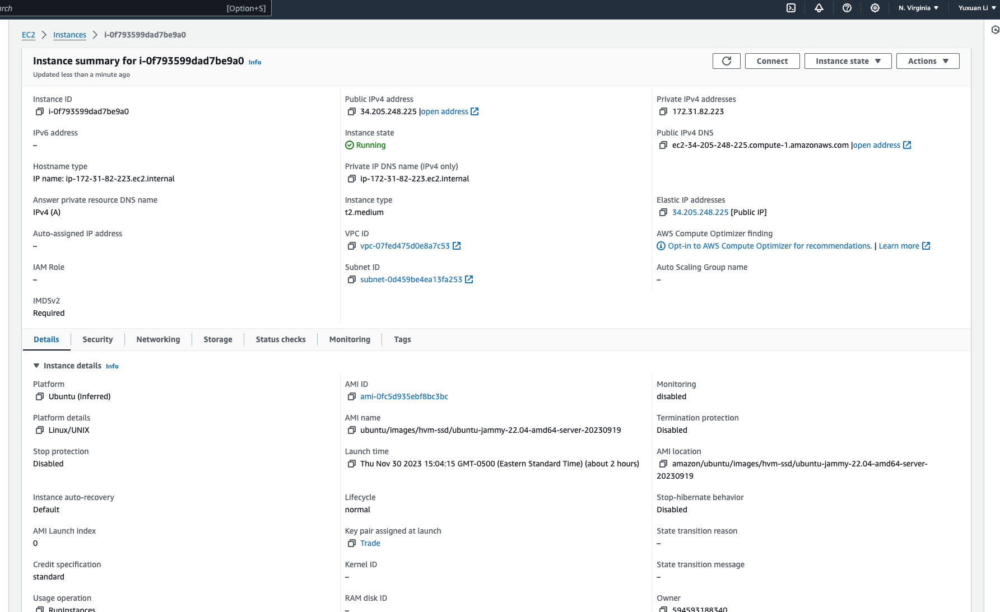

After got my fixed elastic IP address, I use `EC2 instance connect` to connect to my instance and connected to the server successfully and have updated my password:

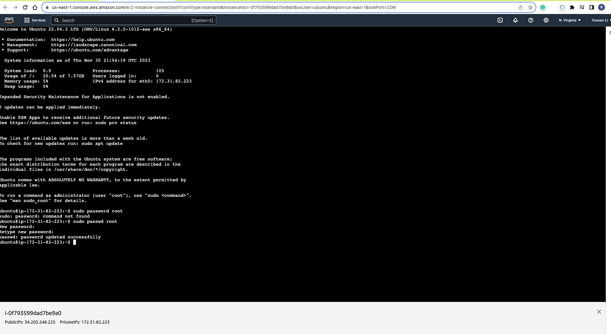

Set the passowrd for the 'super root' and switch to the normal user and modify the `sshd` configure filw and enable the 'root' login, and login remotely with ssh root:

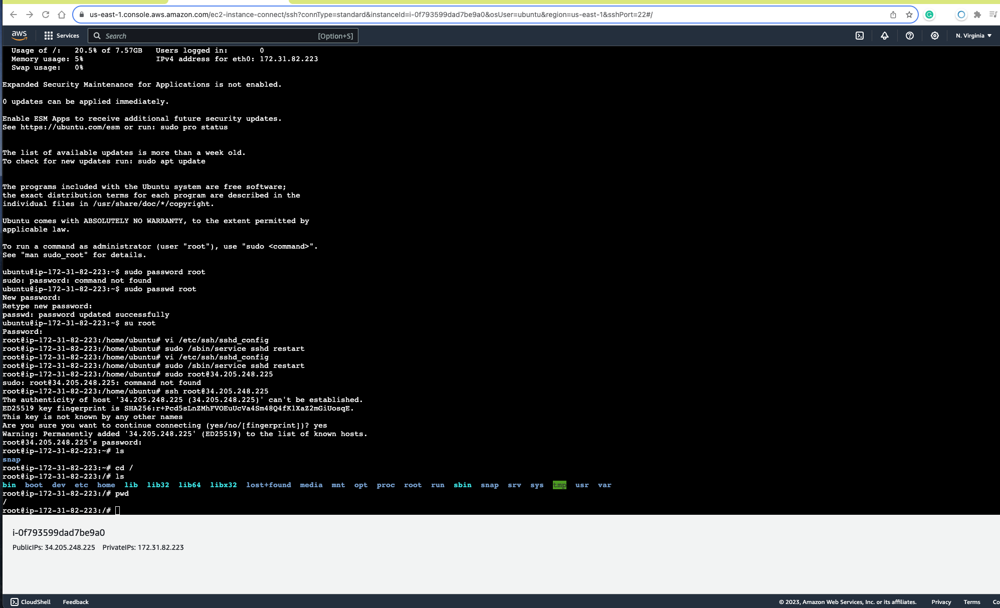

Add the new security rule:
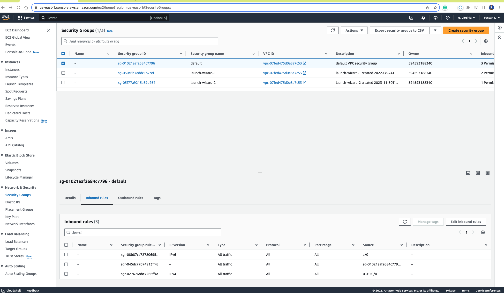

Upload JDK to the remote server:

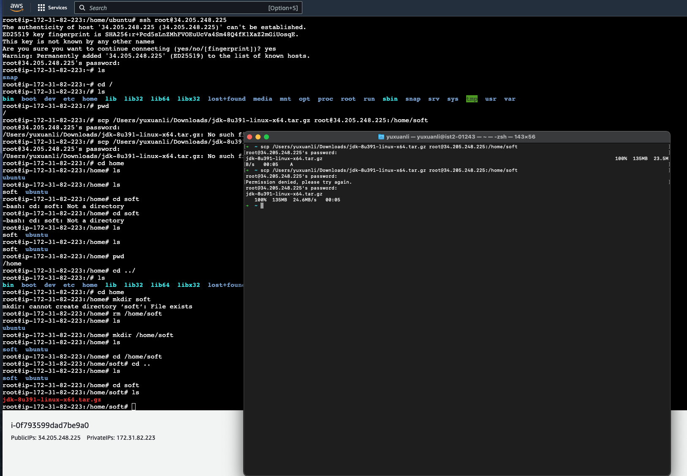

Install SQL and open remote connection and change the necessary configuration file and restart MySQL, I can verifed my MySQL connect to my remote host successfully:

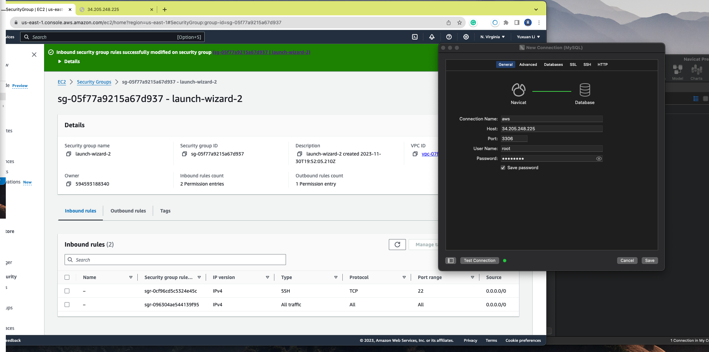

Then I transfer the data from local database into AWS's MySQL

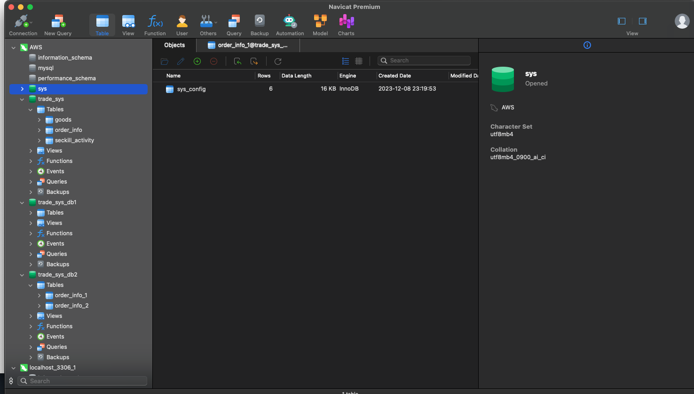

## Install RabbitMQ ##

Install `erlang`, add the public key and RabbitMQ. Then install the necessary Web plug-in. 

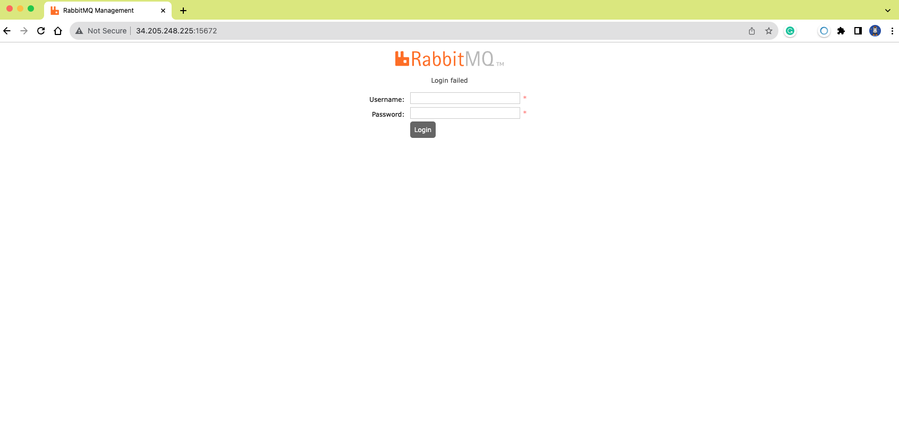

Add user and assigned the administrator role and insure the security group for the server is opening the 15672 port.
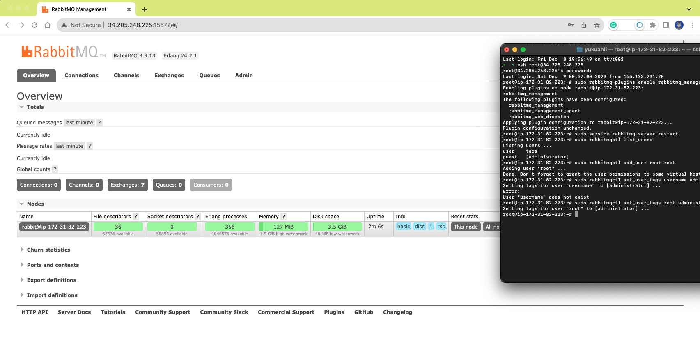

## Install Redis##
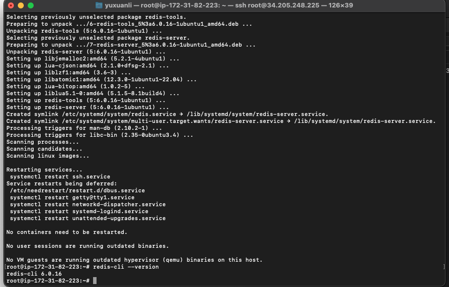

## Install ElasticSearch ##

First downloaded and decompressed the elasticsearch version `7.4.0`. Then add necessary configuration files and set the maximum concurrent number for all users to be `4096`. As ES cannot run as `root`, we need to create an 'non-root' user and here I create an user with name `es` and the specific user could got the foler's permission. And we just switch as es and enter the installation folder for the es and start the `es`'s servies:

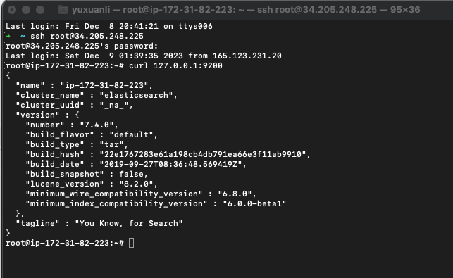

