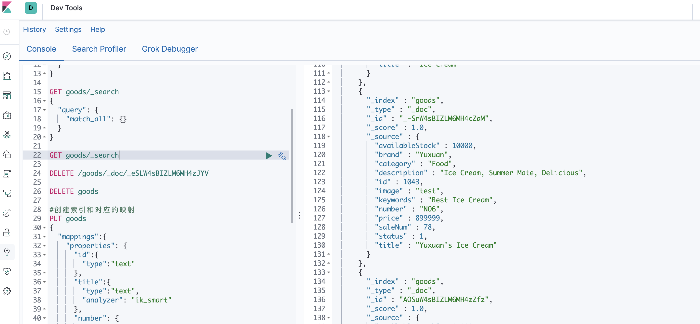
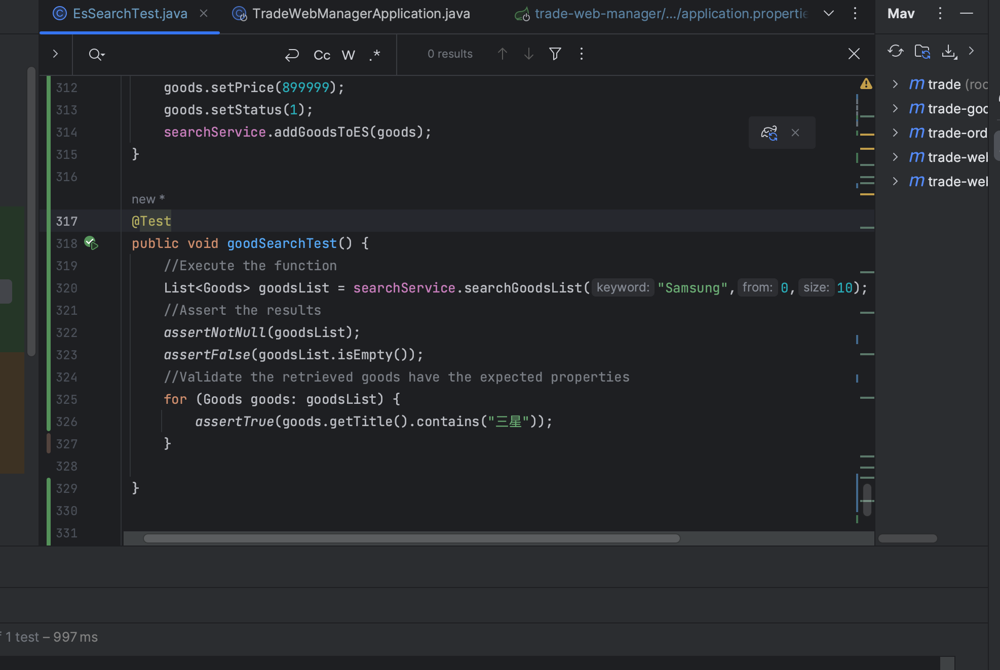
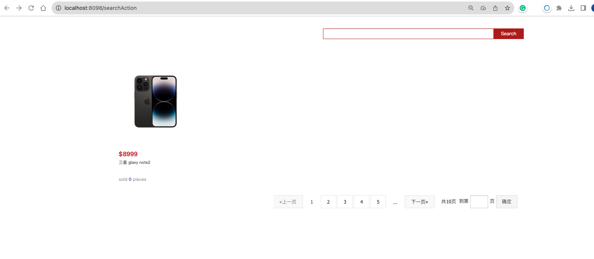
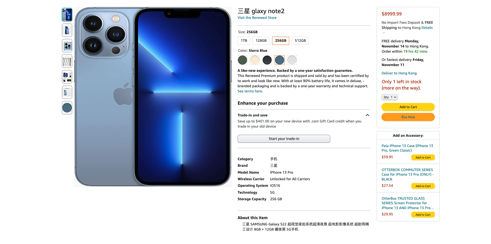

# trade-release

## Assignment for Class 5 (Complete Data: Oct 23)

1. **EsSearchTest**:
   - I have create the index file for 'goods' 
  The result for executing 
  '''
  GET goods/search
  '''
  in Kibana is listed as follows:
   

  From the above image, we can see that the goods are added successfully with the corresponding right mapping.

2.  **Goods Search Test**:

For this part I have write the below code for searching the specific good "Samsung" and assert the cooresponding results like goodsList not null and not empty. Then, I also verified that the obtained 'goods' object indeed have "三星“ in its "title" field. The result is shown below:

 

     

3.  **Goods Searching Listing Page**:

In this part, I firstly imported necessary "search.html" page and corresponding "search" folder and style folder. Then write the portal Controller for this part to deal with the corresponding requestMapping link and then I can see the correct frontend page being configured and when I type the keywords "三星” I can see the product "三星 glaxy note2“ being displayed correctly:

3.  **Write to ES When add goods**:

In this part, we modify our GoodsServiceImplmentation so that We we add our goods to our database, we also add it into ES to maintain the synchronize between the database and the ES search and then we return the mapper so that we can get the id of our goods and the demo of this search is shown below:

The above is the result from "localhost:8098/goods/1044" where 1044 is the goods Id we can see that the goods has been displayed correctly with the id being fetched and the corresponding field being modified and displayed in the frontend page. 