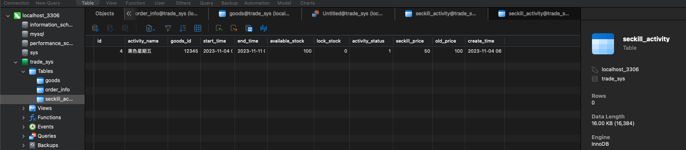
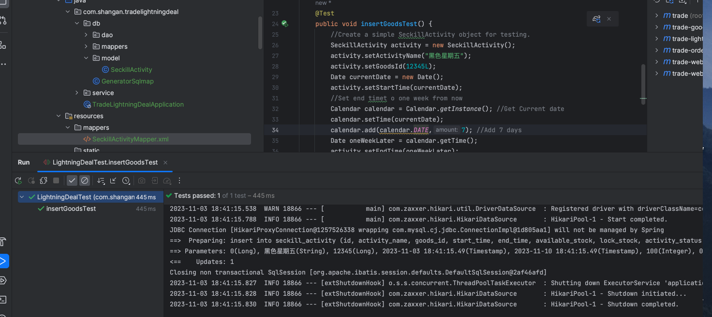
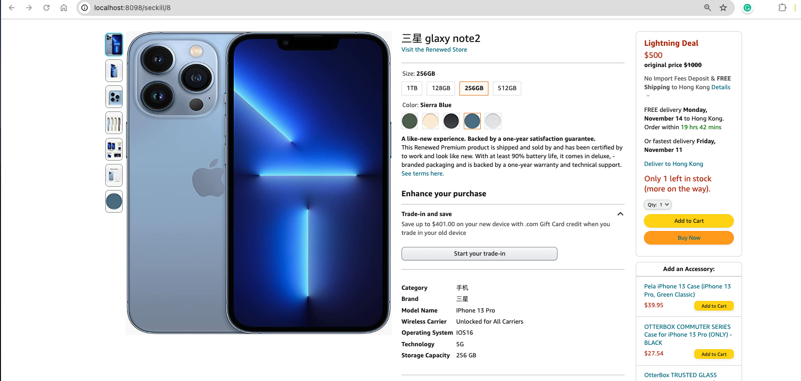
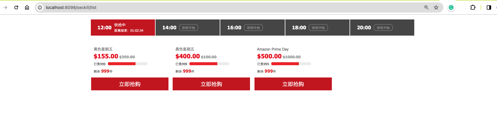

# trade-release

## Assignment for Class 8 
**Completion Date:** Nov 3

1. **Flash Sale Activity**:
  
   - **Database Design**: 

   We first create the flash sale activity table:

  ```sql
CREATE TABLE `seckill_activity` (
  `id` BIGINT NOT NULL AUTO_INCREMENT COMMENT '秒杀活动id',
  `activity_name` VARCHAR(255) DEFAULT NULL COMMENT '秒杀活动名',
  `goods_id` BIGINT DEFAULT NULL COMMENT '商品id',
  `start_time` DATETIME DEFAULT NULL COMMENT '秒杀活动开始时间',
  `end_time` DATETIME DEFAULT NULL COMMENT '秒杀活动结束时间',
  `available_stock` INT DEFAULT 0 COMMENT '可用库存数量',
  `lock_stock` INT DEFAULT 0 COMMENT '锁定库存数量',
  `activity_status` INT DEFAULT NULL COMMENT '活动状态 0-下架 1-正常',
  `seckill_price` INT DEFAULT NULL COMMENT '秒杀价格，单位为分',
  `old_price` INT DEFAULT NULL COMMENT '商品价格，单位为分',
  `create_time` DATETIME DEFAULT NULL COMMENT '创建时间',
  PRIMARY KEY (`id`)
) ENGINE=InnoDB AUTO_INCREMENT=3 DEFAULT CHARSET=utf8mb3 COMMENT='秒杀活动表';
   ```
     
   - **Flash Sale Activity Creation**: 

   In this part, we first configure the `application.properties` and the `mybatis-generator-config.xml` file and the tool for the inverse generation `GeneratorSqlmap` and finally the main start class. 

   - **Flash Sale CRUD development for the database and the `SecSkillActivityDao` interface and its corresponding implementations. 

   - **Add flash sale activity page: In this part, we modifty the 'pom.xml' and add the controller part for adding a new skill activity info. Then, we import the necessary template files for the flash sale pages.

  For the testing, I tried to add a new skill activity "黑色星期五“ with goods_id 12345 start time today (11-04) and the ending time (11-11) one week after the starting time to create an one week period of sale and we can verify from both the console and the database that the test for adding skill activity is successful and the data is added to the database successfully:

  
  
  


2. **Flash Sale Detail Page**:

Then I developed the controller at the module `trade-web-portal` to deal with the display of a specific seckill goods(if there are no corresponding goodsId matches the info stored in the seckill activitiy, a white error page will display. An example of this test is conducted for the 'goods' 三星glaxy note2' and from the below page we can see the lightning deal price as well as the 'original price' are showned correctly and successfully in the page:




3. **Flash Sale Activity List Page**:

Finally, I developed the necessary controller code for the function of querying the whole list of currently active flash sale activity and resolves the issue of the money conversion as well as the `$` to `￥` issue by writing two help function in `SecKillActivity` class:

```java
    public String getSeckillPriceInYuan() {
        return String.format("%.2f", this.seckillPrice / 100.0);
    }
    public String getOldPriceInYuan() {
        return String.format("%.2f", this.oldPrice / 100.0);
    }
```

And modify the corresponidng line in the `seckill_activity_list.html` as follows:
```html
            <div class='price'>
              <b class='sec-price' th:text="'$'+${seckillActivity.seckillPriceInYuan}"></b>
              <b class='ever-price' th:text="'$'+${seckillActivity.oldPriceInYuan}"></b>
            </div>
```

Finally, it is found all the three test sale activities can be displayed correctly:

