# trade-release

## Assignment for Class 12

### Diistrbuted Structure Reconstruct

**Completion Date:** Nov 24

1. **Modification of current works**:

For the modification, basic we follow the following steps:

1. Create a trade-common module and put the public configuration and tools into this module.
2. For other modules, update the corresponding `maven` dependency, add the necessary spring cloud configuration file, the dependency for the `trade-common` module and delete the dependency for other module to ensure the high cohesion, low coupling coding structure. 
3. Add the configuration for the consul in our `application.properties`
4. Modify the `starter` class and add the necessary annotation for our service being discovered and managed in consul.
5. Add the necessary controller for the corresponding project module and hence as the guideline to create the `FeignClient` later in other module.
6. Conduct the start-test for the corresponding module and after we have transfer and modifed all the modules we should see all five modules are being registered, managed and can be discovered in consul:

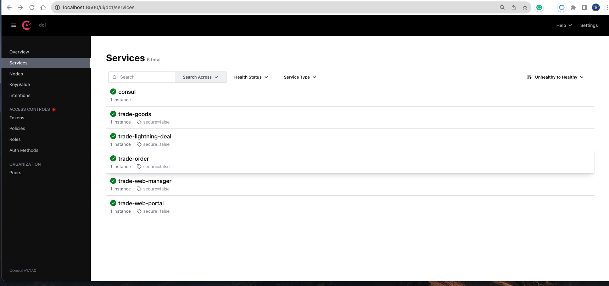

 

2. **Test**:
For this part, we just conducted serveral necessary test to ensure the functionality retains after we conducted the modification on our projects:

**Trade Goods, Order module and Web Manager Module**:
(1):First test the function of adding new goods to the database:

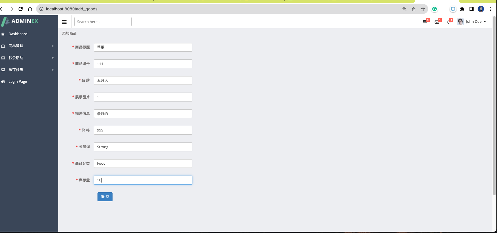
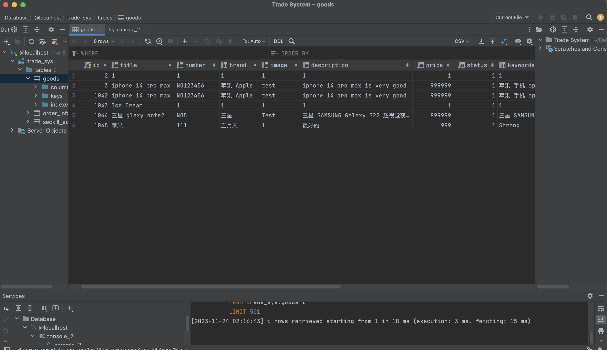

It is found after we add information in our webmanager page, the database indeed have new goods records.

(2): We test we can see the goods detail for certain goods:
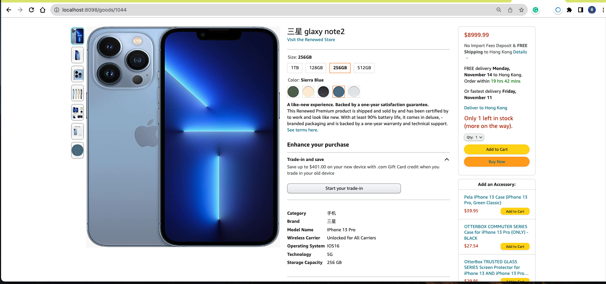
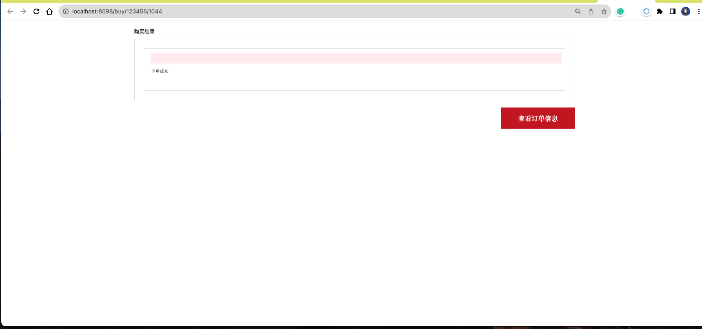
When we click the button `Buy Now` we will send the proper reqeust to the backend and jump to the `buy/userId/goodsId` path successfully.

(3): GoodsSearch Test:
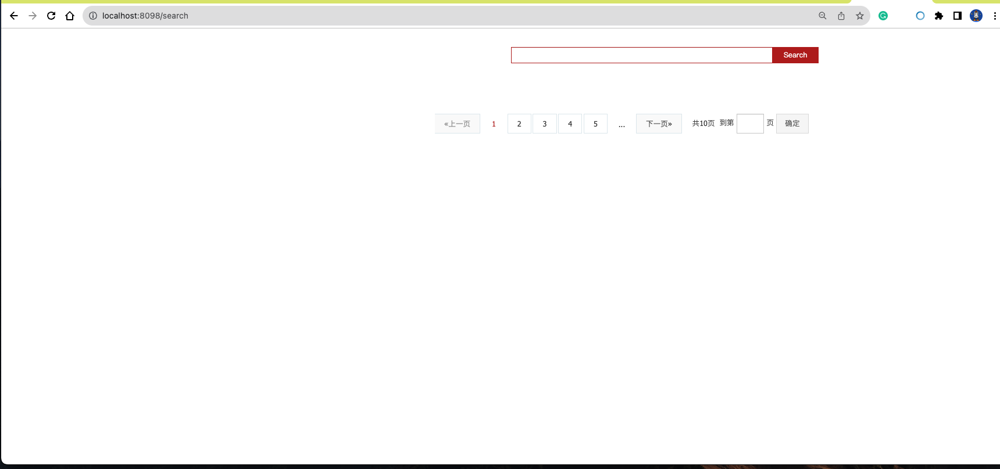
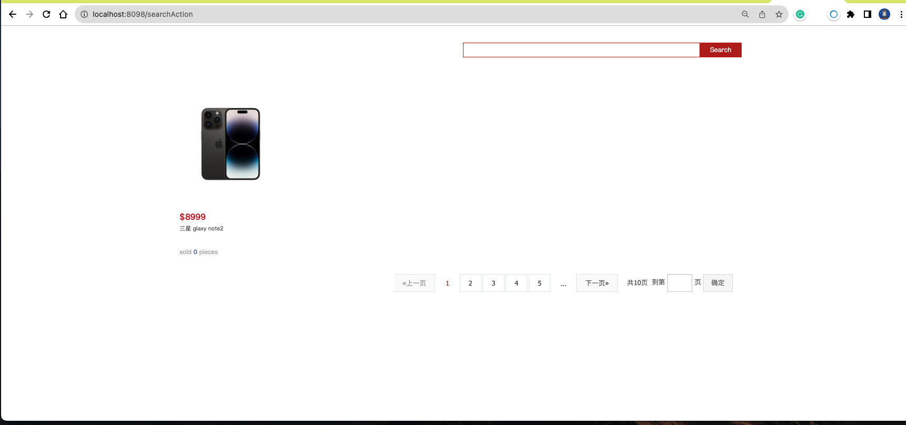

**Trade-Order, Trade-Seckill and Trade-WebPortal Test** 

1. We can sucessfully create an order:

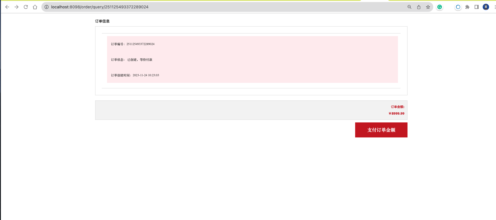

If the user didn't pay the order after certain time, the order will close automatically:

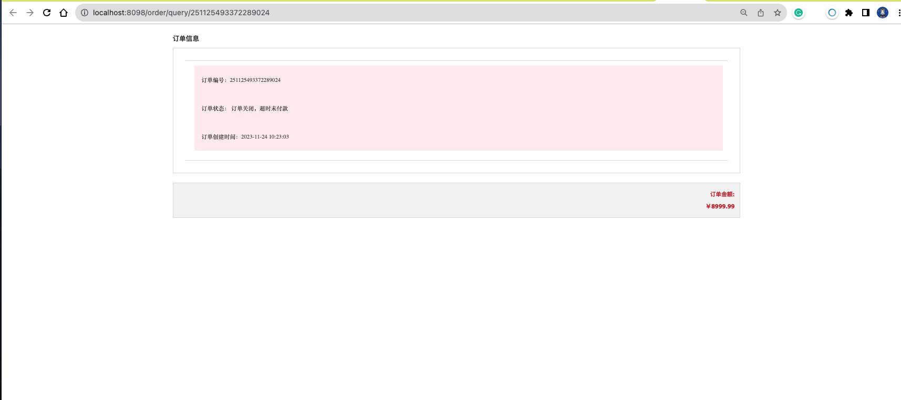

2. Order payment:

Instead, we can also pay our order directly and verify the status of this order has been changed and corresponding hint message being printed out:
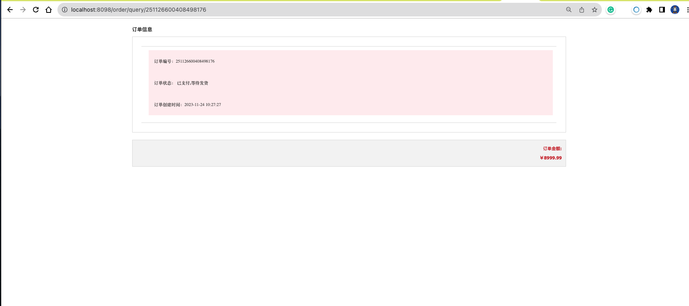 

3. Seckill Activity:
We can see the list of seckill activities:
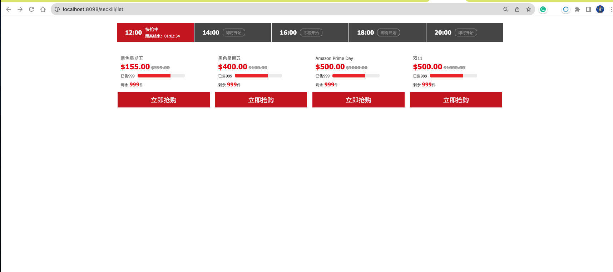

We can also see the detailed page of the seckill activity:
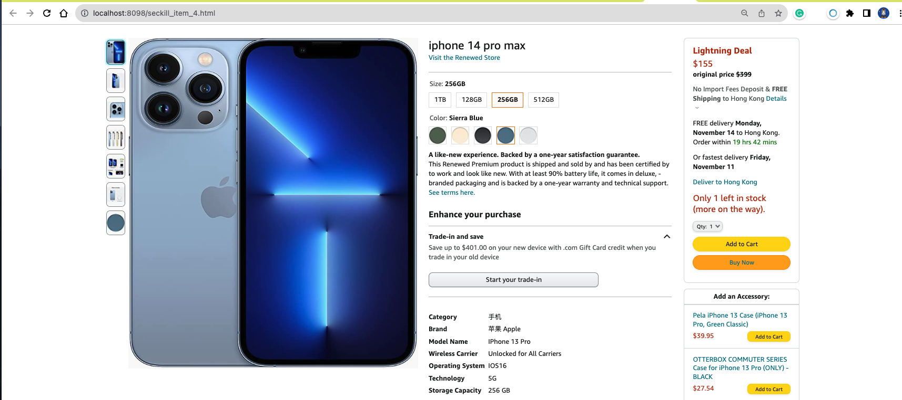

Then we can buy certain goods and verifed the status also in the console
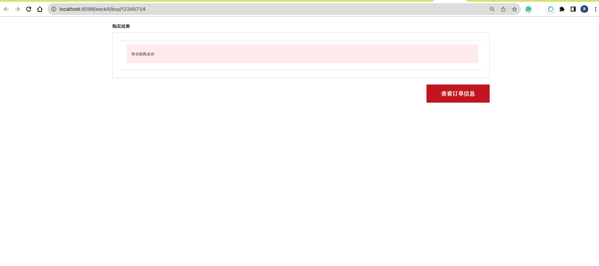

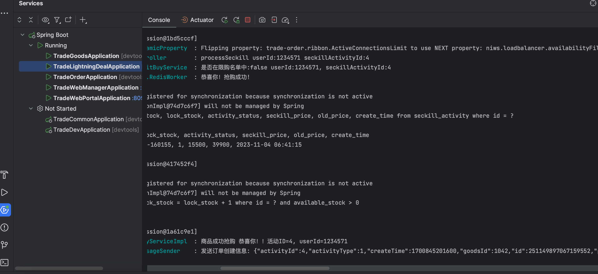

If we didn't pay the ordr within the given time, the order will be closed with the proper message being sent properly in the console and the webpage:
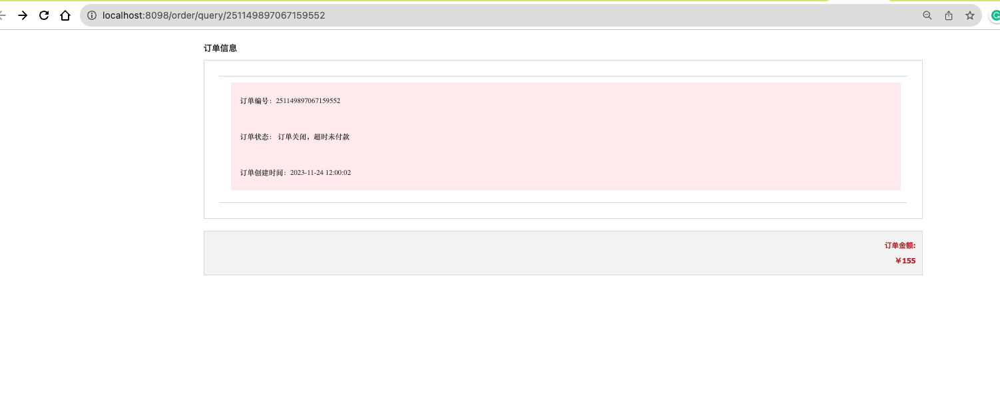
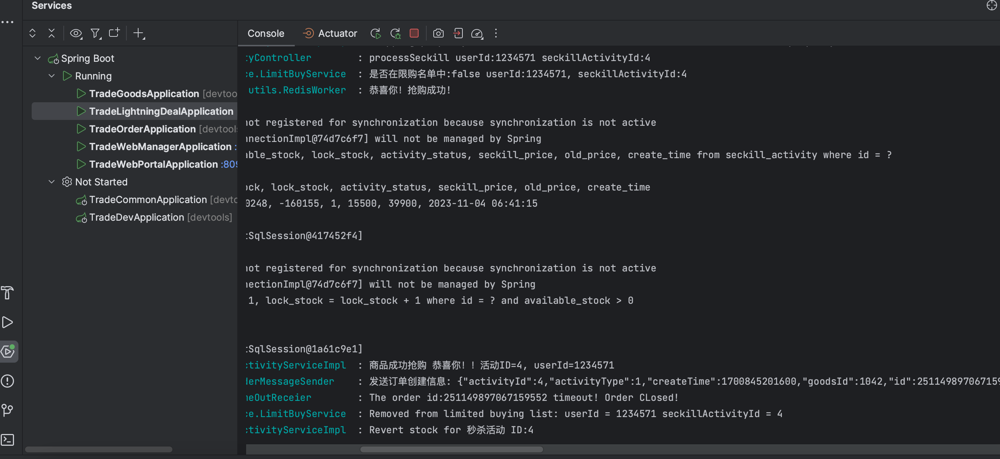

