# trade-release

## Assignment for Class 9
**Completion Date:** Nov 10

1. **Mock the inventory overselling situation in high concurrent situation**:
  
   - **Deduct Inventory Stock**: 

   We first write the function to deal with the flash sale request in `SeckillActivityService` and its implementing class and then create the `update` tag in the corresponding mapper and implement the update by primary key method in `SeckillActivityDao` interface and its corresponding implement class and finally the corresponding controller.

   During the test process in this section, we will choose id: '4' corresponding to the flash sale activity: "黑色星期五”：
   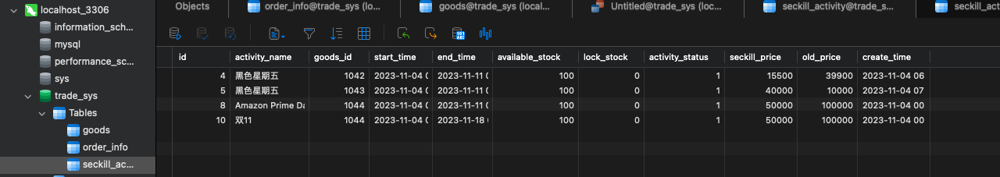
   We can verify the basic behave by calling our controller mapping url and shown:
   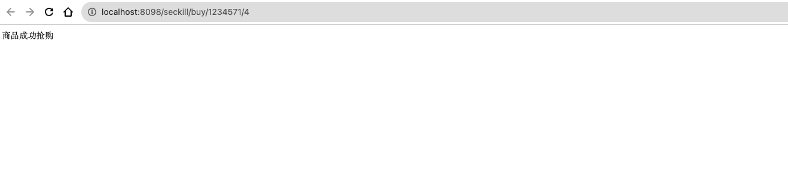
   we can also verify this in the console:
   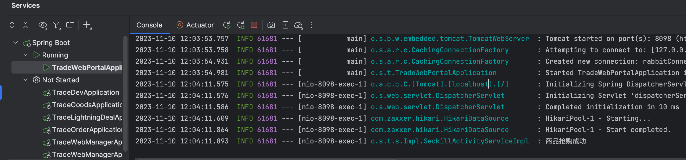


2. **Jmeter**:

In this part we first download and install JMeter and go to the `bin` directory and running the jmeter application.

Then we create our own threading group and add the corresponding http request for the stress test and set the corresponding protocol, iP , port and the request path as follows(here we mock the behaviour for userId 12345 and the seckill activity also 4 in the request path):

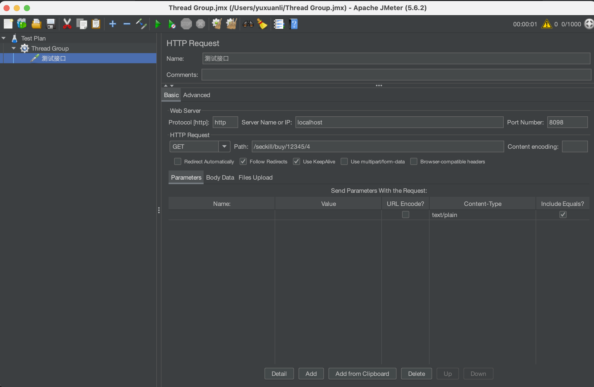
Then we can demonstrate the overselling process by simulate 1000 concurrent request coming together:

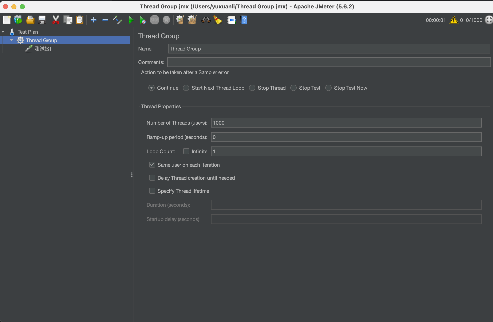
And then after strat running we can find that the stock is chane from the original 100 into a negative value:
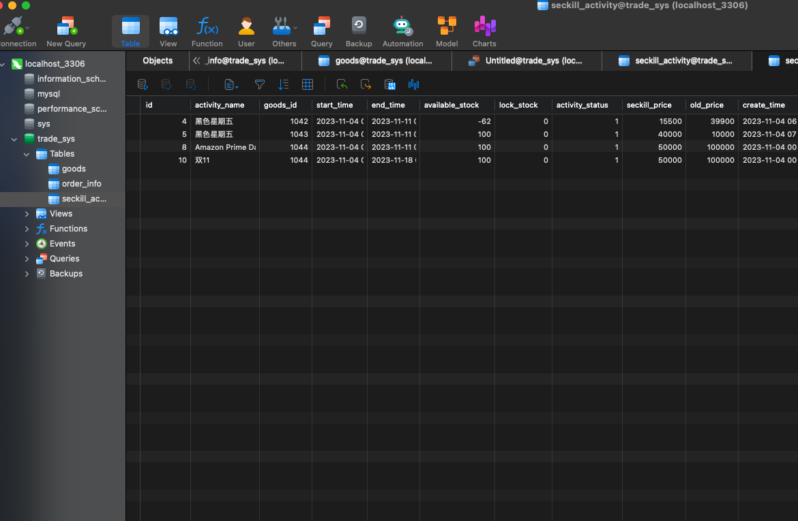


3. **Oversell Solution**:

To resolve this issue and ensure the high performance in the high concurrent situation, we decided to use the RedisLua script solution. We can first download redis(http://redis.io/download), choose the version 6.0.16 and decompress it and got the `src` directory `./redis-server` and start it:

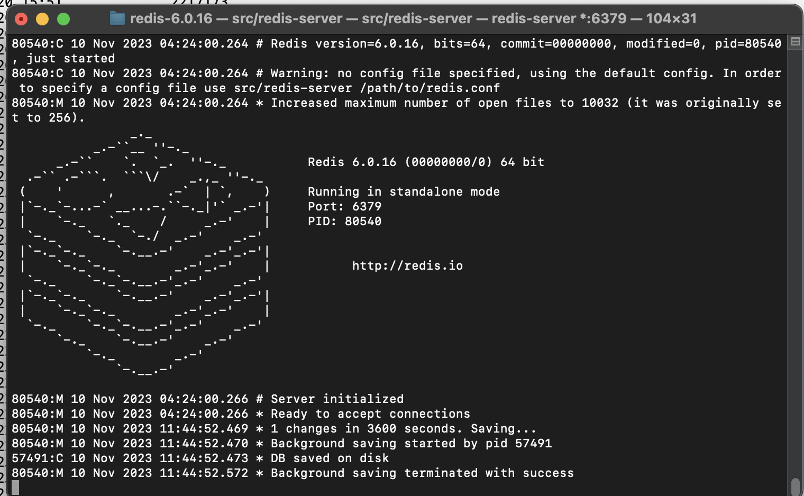

Then, we may start to integrate the change into our project:
First of all, for the `trade-lightning-deal` module, we can add the dependency into `pom.xml` and the `JedisConfig` file. 
Then we may start to implement some basic of the redis worker class and conduct some unit test as follws:

```java
public class RedisTest {
    @Autowired
    public RedisWorker redisWorker;

    @Test
    public void testSetKeyValue() {
        String key = "Yuxuan";
        String value = "The best SDE";
        //Call the method to set
        redisWorker.setKeyValue(key, value);
    }

    @Test
    public void testGetValueByKey() {
        String key = "Yuxuan";
        String expectedValue = "The best SDE";
        String actualValue = redisWorker.getValueByKey(key);
        System.out.println(actualValue);
        assertEquals(expectedValue, actualValue);
    }
}
```
The test are both successful with the `The best SDE` string being printed successfully:

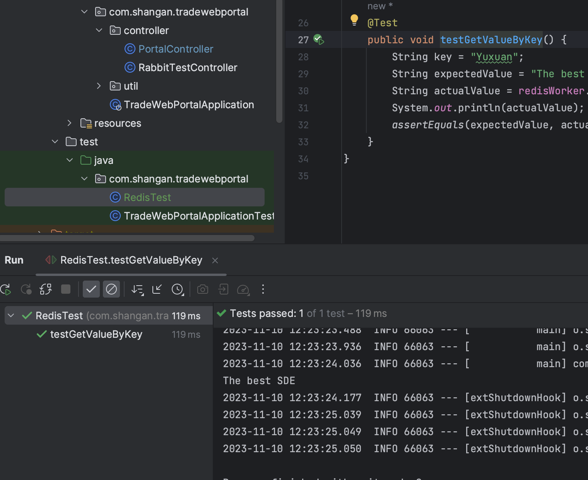

We also implement another `setValue` function to receive the second parameter `long` type as an arugument and conduct the corresponding test:
```java
    @Test
    public void setStockTest() {
        redisWorker.setValue("stock:12345", 100L);
    }

    @Test
    public void stockCheckTest() {
        redisWorker.stockDeductCheck("stock:12345");
        System.out.println(redisWorker.getValueByKey("stock:12345"));
    }
```

The result shown that the inventory are deducted succesfully and "抢购成功“：
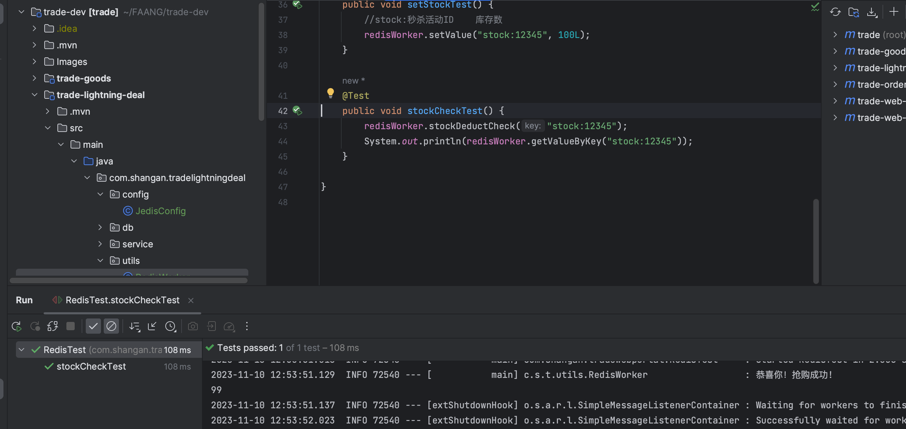
The stock content is changed from '100' to '99'.

Finally, we just combine the logic for stock deduction adn the lua and write a new method named `processSecKillSolution` to utilize the redisWorker to deduct the stock and use stock lua to verify first before deduct the stock and also update to use this method in our portal controller.

For the test, we again simulate the situation for the 1000 requests and could find this time the stock just deduct to zero and without the stock oversell problem anymore:

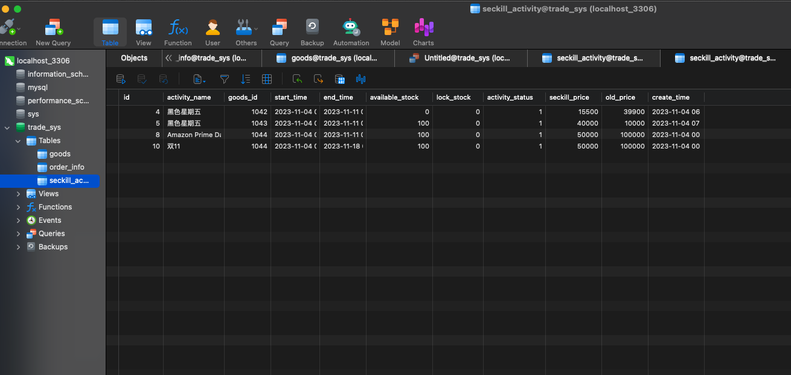

Now, if we try to run stockCheckTest again we can also verify the result that the stock just deduct to zero and we cannot checkout any stock anymore since there is no such available:

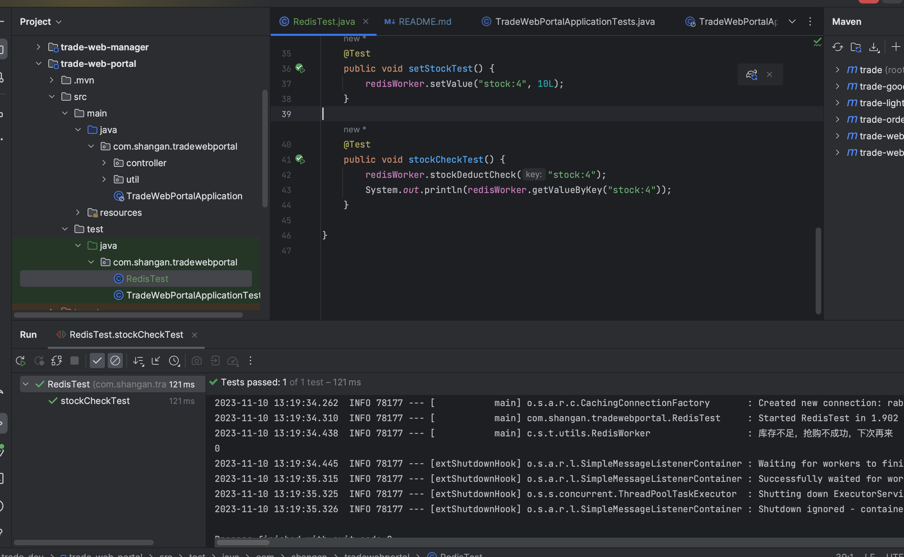