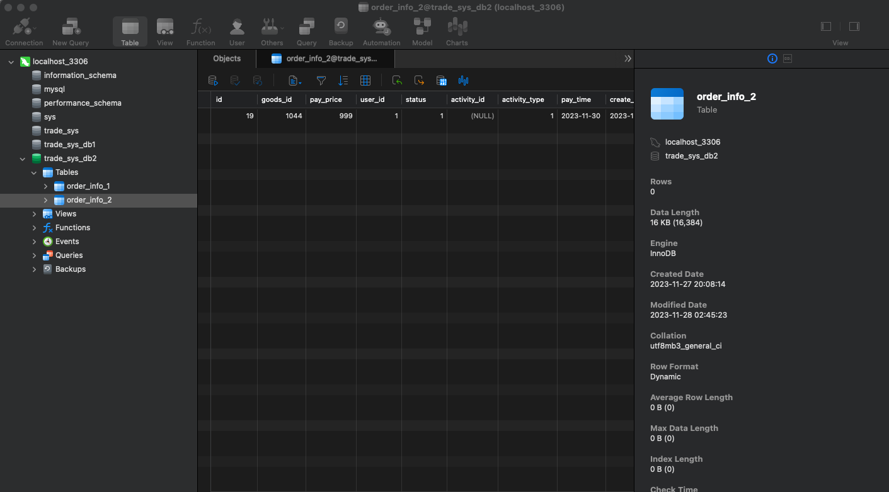
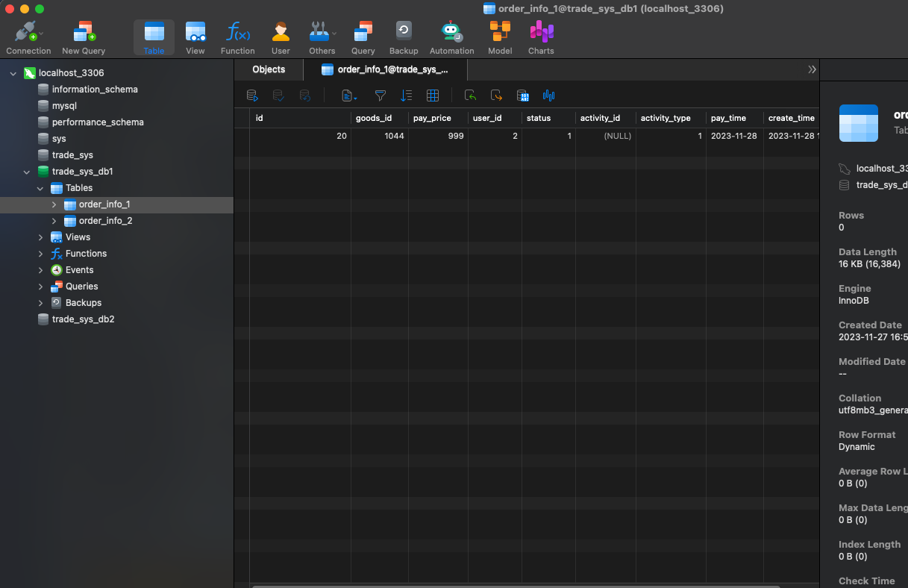
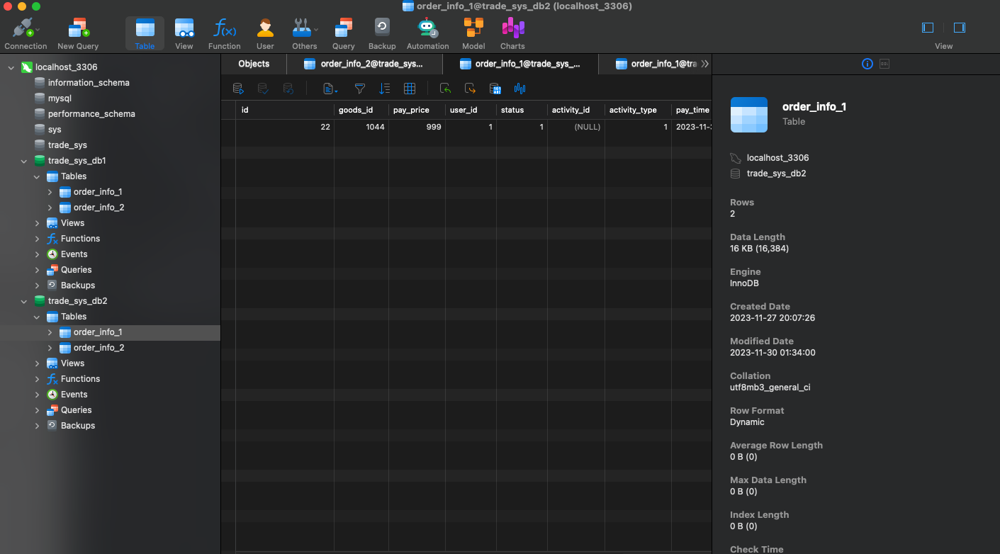
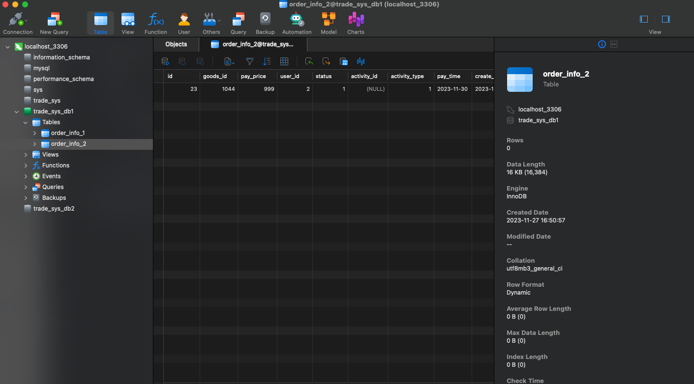
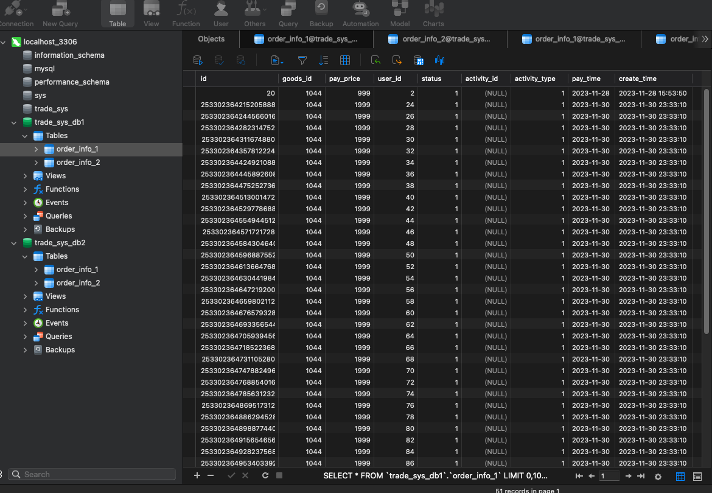
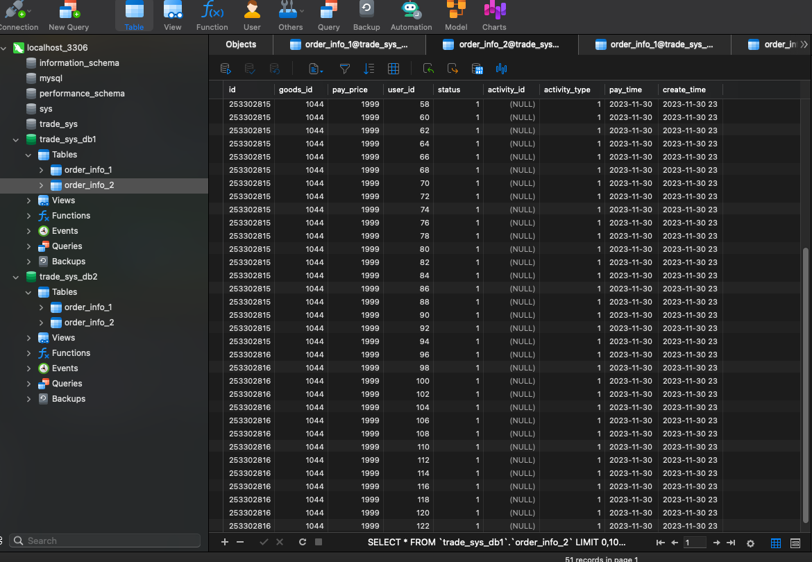
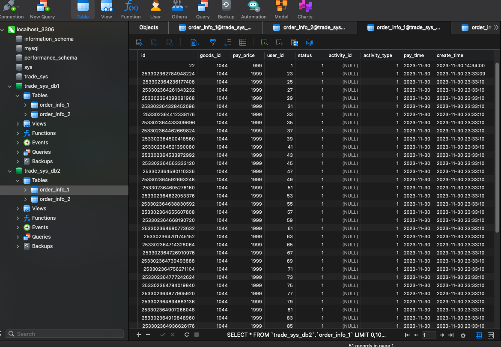
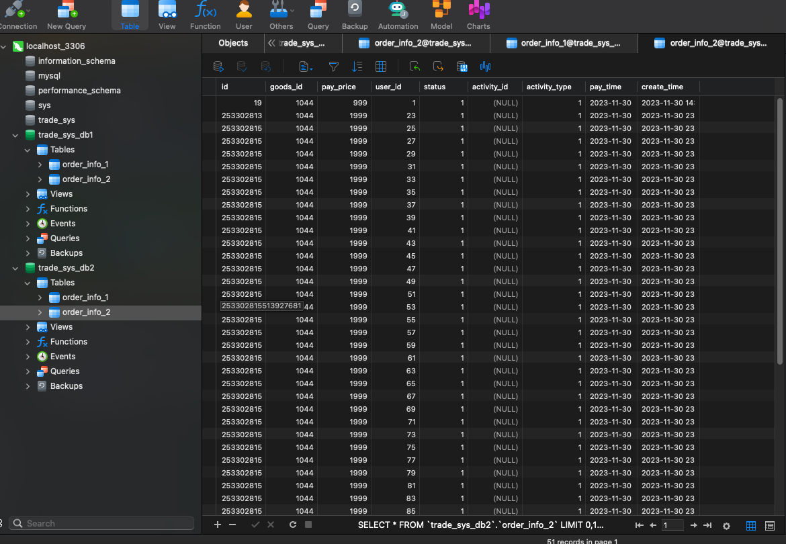
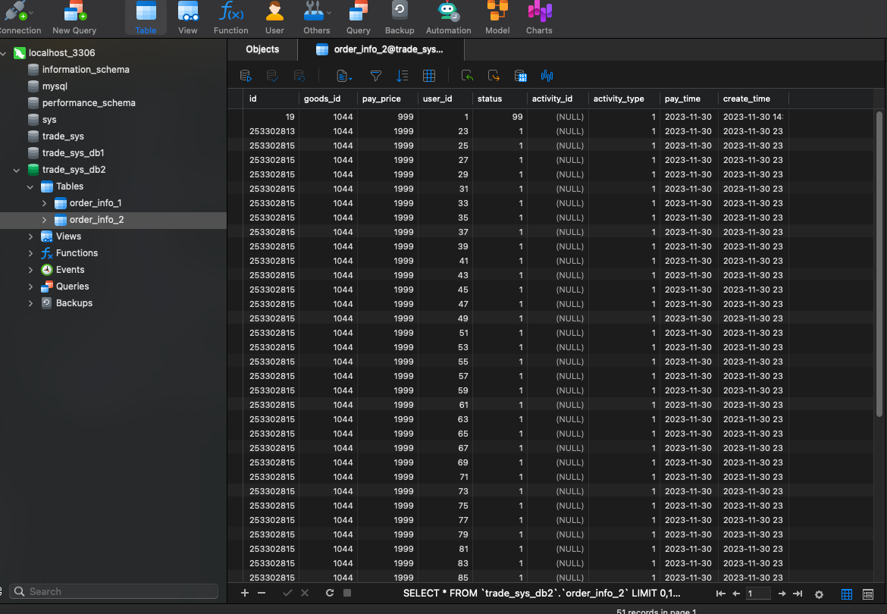

# trade-release

## Assignment for Class 13

### Data sharding

**Completion Date:** Nov 27

1. **Database Creation**:

In order to complete the data sharding modification, I created two additional database namely `trade_sys_db_1` and `trade_sys_db_2` and in each database, I created two additional table namely `order_info_1` and `order_info_2`. I tried to put the order logic for a single user all in one database but conduct horizontal sharding for all the order information according to the order Id. At the mean time, according to different userId, I tried to distribute different user into different database in order to increase the availability and the performance of the system.


 

2. **Maven Dependency**:
Important the necessary dependency for sharding-jdbc including `sharding-jdbc-spring-boot-starter`(part of Apache ShardingSphere and provides the core functionality for database sharding and data partitioning in a Spring Boot application) and `druid-spring-boot-starter`(integrates Alibaba's Druid database connection pool with Spring Boot, it is a high-performance dtabase connection pool that offers advanced features for database connection management).

3. **Configuration**:
For this part we mainly add some configuration code in `application.properties` we first defined the `actual-data-nodes` with our database configuration and then define the sharding-column for the sharding table and also the `user_id` as the key for database sharding.

The corresponding code are listed as follows:
```java
#m1.order_info_1 m1.order_info_2 m2.order_info_1 m2.order_info_2
#improve the scalability and performance of the application
spring.shardingsphere.rules.sharding.tables.order_info.actual-data-nodes=m$->{1..2}.order_info_$->{1..2}

spring.shardingsphere.sharding.tables.order_info.key-generator.column=id
spring.shardingsphere.sharding.tables.order_info.key-generator.type=SNOWFLAKE

#sharding-column
#horizontally scaling databases
#If id is 1 -> 1 % 2 + 1 = 2 -> order_info_2
#if id is 2 -> '2 % 2 + 1 = 1 -> order_info_1
spring.shardingsphere.sharding.tables.order_info.table-strategy.inline.sharding-column=id
spring.shardingsphere.sharding.tables.order_info.table-strategy.inline.algorithm-expression=order_info_$->{id % 2 +1}

#user_id
#both table-level and database-level sharding for the 'order-info' table using Apache
#shardingsphere in a spring boot application
spring.shardingsphere.sharding.tables.order_info.database-strategy.inline.sharding-column=user_id
spring.shardingsphere.sharding.tables.order_info.database-strategy.inline.algorithm-expression=m$->{user_id % 2 +1}

```

3. **Testing**:

## Testing for sharding

Based on our sharding rules, we have identified four main test cases to validate the functionality and effectiveness of our implementation. Below are the details for each test case:

### Test Case 1: [Odd UserId + Odd Order Id]
- **Description:** I tried to insert a new order with `userId: 1, Id: 19`.
- **Expected Results:**  According to our sharding logic, userId % 2 + 1 = 19 % 2 + 1 = 2 -> to `trade_sys_db2`.
GoodsId % 2 + 1 = 19 % 2 + 1 = 2 -> go to `order_info_2`
- **Actual Result:** 


### Test Case 2: [Even UserId + Even Order Id]
- **Description:** I tried to insert a new order with `userId: 2, Id: 20`.
- **Expected Results:** According to our sharding logic, userId % 2 + 1 = 2 % 2 + 1 = 1 -> to `trade_sys_db1`.
GoodsId % 2 + 1 = 20 % 2 + 1 = 1 -> go to `order_info_1`.
- **Actual Result:**



### Test Case 3: [Odd UserId + Even Order Id]
- **Description:** I tried to insert a new order with `userId: 1,Order Id: 22`.
- **Expected Result:** According to our sharding logic, userId % 1 + 1 = 1 % 2 + 1 = 2 -> to `trade_sys_db2`.
GoodsId % 2 + 1 = 22 % 2 + 1 = 1 -> go to `order_info_1`.
- **Actual Results:** 

### Test Case 4: [Even UserId + Odd Order Id]
- **Description:** I tried to insert a new order with `UserId: 2, Order Id: 23`
- **Expected Result:** According to our sharding logic, userId % 1 + 1 = 2 % 2 + 1 = 1 -> to `trade_sys_db1`.
GoodsId % 2 + 1 = 23 % 2 + 1 = 2 -> go to `order_info_2`.
- **Actual Results:** 

### Test Case 5: Generates lots of different userId and GoodsId simulation:

In this part, I used `Snowflake` to generate different Id and different userId to test the system's capability under a slightly heavy id generation cases. 

```java
        for (int i = 0; i < 100; i++) {
            System.out.println("Generate Snowflake Distributed Id Test:");
            Order order = new Order();
            order.setId(snowFlake.nextId() + 1);
            //order.setId(snowFlake.nextId());
            order.setUserId(23L + i);
            order.setGoodsId(1044L);
            order.setPayTime(new Date());
            order.setPayPrice(1999);
            order.setStatus(1);
            order.setActivityType(1);
            order.setCreateTime(new Date());
            boolean insertResult = orderDao.insertOrder(order);
            System.out.println(insertResult);
        }

```
`Question about the snowFlake.nextId()`

And it is found the generated ordr can be sharding correctly into different tables and databases according to our's sharding rule:









### Test Case 6: After sharding, test search and update some order:
I conducted the following test to update the order status of order 19:
```java
    @Test
    public void updateTest() {
        Order order = orderService.queryOrder(19L);
        order.setStatus(99);
        orderService.updateOrder(order);
    }

```
Result shows the order can be sucessfully fetched and the corresponding order status can be updated:



`Question2: What is datasourceHealthConfig`

```java
package com.shangan.trade.order.config;

import org.springframework.beans.factory.ObjectProvider;
import org.springframework.beans.factory.annotation.Value;
import org.springframework.boot.actuate.autoconfigure.jdbc.DataSourceHealthContributorAutoConfiguration;
import org.springframework.boot.actuate.health.AbstractHealthIndicator;
import org.springframework.boot.actuate.jdbc.DataSourceHealthIndicator;
import org.springframework.boot.jdbc.metadata.DataSourcePoolMetadataProvider;
import org.springframework.context.annotation.Configuration;
import org.springframework.util.StringUtils;

import javax.sql.DataSource;
import java.util.Map;

@Configuration
public class DataSourceHealthConfig extends DataSourceHealthContributorAutoConfiguration {
 
    @Value("${spring.datasource.dbcp2.validation-query:select 1}")
    private String defaultQuery;
 
 
    public DataSourceHealthConfig(Map<String, DataSource> dataSources, ObjectProvider<DataSourcePoolMetadataProvider> metadataProviders) {
        super(dataSources, metadataProviders);
    }
 
    @Override
    protected AbstractHealthIndicator createIndicator(DataSource source) {
        DataSourceHealthIndicator indicator = (DataSourceHealthIndicator) super.createIndicator(source);
        if (!StringUtils.hasText(indicator.getQuery())) {
            indicator.setQuery(defaultQuery);
        }
        return indicator;
    }
}

```