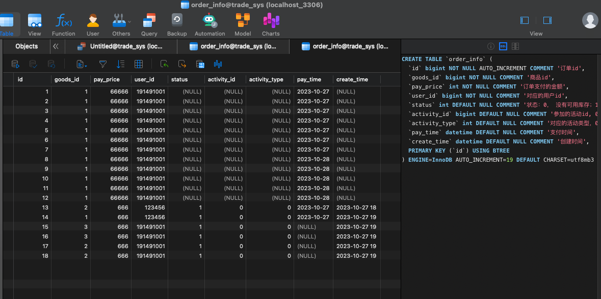

# trade-release

## Assignment for Class 6 (Complete Data: Oct 27)

1. **Construct Order Table and Order CRUD**:
   - I have constructed the order table, and write the following Junit test:

  The result for the test is:

   
  We can also find that the data are inserted into the database successfully:
  

2.  **Implement of the oder create**:

For this part I create the orderservice interface and write the implement class that implement the 'createOrder' method, then, I create the controller for the corresponding order create path and complete the addition of the order result page:
 
It can be found I just create a 'goods' id 2 for the user with id '191491001'.

3.  **Order ID Generation and Order Detail Page**:

In this part, I generate the oderId using snowflake algorithm which is simple and high efficiency algorithm based on the timestap and can ensure the id of the order can be increase in a certain order and there are no repeated order in the highly distributed environment to generate millions of no-repeating id. After that I developed the order detailed page and complete the function of queryOrder in OrderService and we can query the details of the certain order as follows:

It can be found we can query with certain order ID and can see the oder id, status and the order create time information.

3.  **Order Payment**:

In this part, I implemented the order payment the service and the logic for the order payment verification and mock the order payment process and change the staus fof the order form 'created and wait for payment' into 'payment completed', the result is shown:

According to the above page, we can see if we click the button for 'order payement in the previous part, the page will be refershed and we can found that the status of the order has been changed succesfully to "订单状态：已支付，待发货”.