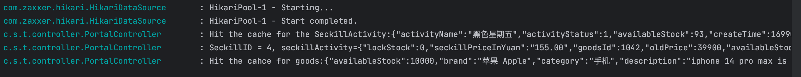
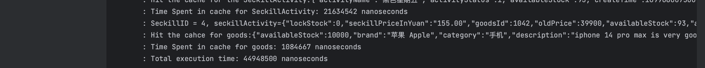
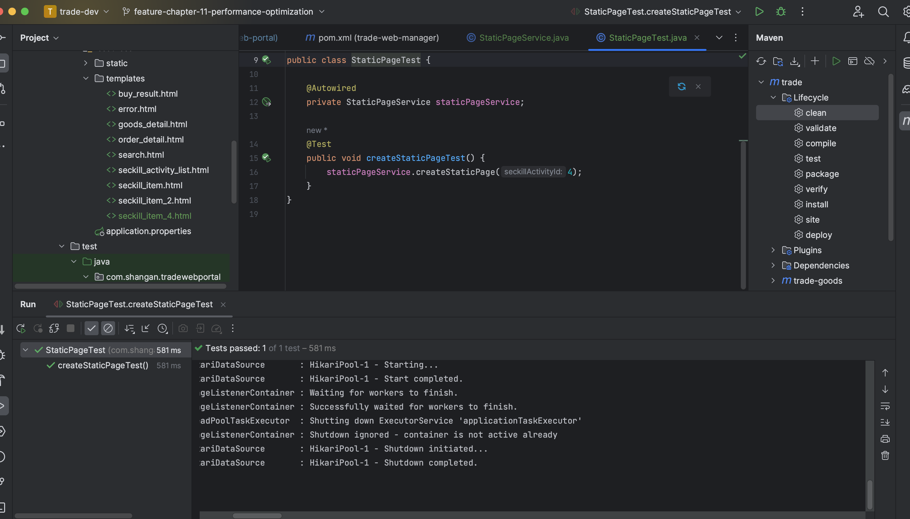

# trade-release

## Assignment for Class 11

### Performance Optimization 

**Completion Date:** Nov 17

1. **Cache Warm Up**:

Cache warm-up is the advance loading of relevant cached data directly into the cache system. To avoid the problem of querying the database first and then caching the data when the user requests, the user can directly query the cached data that has been warmed up in advance, reducing the pressure on the DB and improve query speed. 
  
   - **Write the Seckill Info into Redis**: 

   The first part is to write the Seckill information into the Redis including the stock information with the `Long ` type number, the SeckillActivity's full information in `JSON String` format and the goods information (the goods in the seckill activity) also in the same format. Then I modify the `ManagerController` to add the corresponding path for jumping to cache warm-up page and also the path for write the corresponding seckill activity id and its corresponding information into the cache


2. **Add push Seckill Page**:

Add the `push_seckill_cache.html`

3. **Detail page got data from the cache**:

I add the logic and mainly changed the method for the mapping for the flash sale activity detail page, the main logic is to first tried to get the data from the `Redis` and if there are no corresponding information in the cache then we query the database:

```java
String activityKey = "seckill:activity" + seckillId;
        String activityJson = redisWorker.getValueByKey(activityKey);
        long startCache = System.nanoTime();
        if (activityJson != null) {
            seckillActivity = JSON.parseObject(activityJson, SeckillActivity.class);
            log.info("Hit the cache for the SeckillActivity:{}", activityJson);
        } else {
            long startDb = System.nanoTime();
            seckillActivity = seckillActivityService.querySeckillActivityById(seckillId);
            long endDb = System.nanoTime();
            log.info("Database query time for SeckillActivity: {} nanoseconds",(endDb - startDb));
            //Check if the activity exists or not?
            if (seckillActivity == null) {
                log.error("No seckill activity found with ID:" + seckillId);
                throw new RuntimeException("Do not found the corresponding seckillInfo");
            }
            //Put the info into Redis
            redisWorker.setValue(activityKey,JSON.toJSONString(seckillActivity));
        }
```
Moreover, in order to test and compare the different execution time for the redis cache and normal database query: I applied the Java's embedded method: `System.nanoTime()` for measuring such short time operation as it provided a higher precision. 


3. **Testing for the Cache Warm-Up**:

For the testing part: 

We first add the cache warm-up for the seckillactivity: "黑色星期五“ with id: 4 into our system(with path: `/pushSeckillCacheAction`)


Then in order to verify that we indeed hit the cache we search for the corresponding seckill activity:


The goods corresponding to the seckillactivity can be displayed successfully and we can verify from the console:



Moreover, in order to simply verify the advantage of the Redis cache and also compared about the running time, I conducted two tests with the operation to searching at the first time for one seckill activity that stored in the cache and another without storing in the cache:


It is found that the total execution time for searching out the corresponding information is about 44.9 millisconds. Then, I also tried to search one seckill activity called "双十一” with id: 10


Then, we also verified the corresponding searching speed and found it is:

The corresponding time for searching out info is about 336.9 milliseconds. It is found that there is an order of magnitude improvement for the `frist-time` searching speed using cache warm-up. 

4. **Page Static Development**:

Page static is the process to turn the original dynamic websites(by querying the data in the databse to render the page) into a static web page generated by the static technology, so that when the user accesses the webpage, the server responds to the user directly to the static page, there is no dynamic query database process. 

For the development of the static page: 
We first add the necessary dependency for the Thymeleaf and then create static page service in `trade-web-portal` and then write the corresponding test class and tried to generate a static page for our seckill activity with id: 4 (for "黑色星期五“)。

5. **Test for the Static Page**:

I moved the generated static html page file `seckill_item_4.html` into the static folder of the current package file:



For the static page, we can also viisted directly by typeing the corresponding html name in our `localhost` path:


`Question: How to integrate this into projects in practice?`

```java
 long startTotalStatic = System.nanoTime();
        //Locate the static page
        Resource resource = resourceLoader.getResource("classpath:/static/seckill_item_" + seckillId + ".html");
        if (resource.exists()) {
            //Redirect since static page exists
            long endTotalStatic = System.nanoTime();
            log.info("Find static Page! Total execution time: {} nanoseconds", (endTotalStatic - startTotalStatic));
            return "redirect:/seckill_item_" + seckillId + ".html";
        } else {
            other logic to take data from Redis or database normally...
        }

```

In my implementation, I add the logic into our controller for seckillInfo with the path for mapping to be `/seckill/{seckillId}` and when the user request to find some details about certain seckill activity, we will first tried to use `ResourceLoader` to find the corresponding static file and if found we will use the `redirect:` prefix to redict the client to the new URL corresponding to our static resource. If the corresponding resource does not exists(we do not have the corresponding static page), we just back to the original logic and generate the page dynamically. 

As you can see in the above code, I also tried to calculate the time needed for loading the static page for seckillActivity id： 4， it is found the loading time is only: 0.06 milliseconds, much much faster than dynamic loding page. 


5. **Handle Malicious Request**:

The malicious request refers to some program that forge normal requests and consume the server's resources and causes server to down. To handle this kind of requests: In our projects, we take the method of the blacklist mechanisum that takes risk control identification for the blacklist database's IP and userId. To implement this, the logic is to put the blacklist's user ID into Redis and judge whehter the corresponding user is in the blacklist or not before we conduct any purchase request. We create a `RiskBlackListService` in `trade-goods` module that has method to add one or more userId into the blacklist control list, check whether a given userId is in there or not and remove a certain userId out of the list. Then during the `createOrder` logic, we add the following code before I handle the normal user's create request:

```java
    //First check whether the user is in the black list or not
        if (riskBlackListService.isUserInBlackList(userId)) {
            log.error("User with ID {} is in the blacklist, cannot create order", userId);
            return null;
        }
```
The logic is that if I found that the given userId is in the BlackList, I just retrun `null` and later in my portal controller's handle purchase request method, I wrote:
```java
            Order order = orderService.createOrder(userId,goodsId);
            //Create a new order using OrderService
            if (order != null) {
                modelAndView.addObject("order",order);
                modelAndView.addObject("errorInfo","下单成功");
                modelAndView.setViewName("buy_result");
            } else {
                modelAndView.addObject("errorInfo","创建订单失败 用户已在黑名单中");
                modelAndView.setViewName("error");
            }
```

5. **Test for Malicious Request**:
For testing our `RiskBlackListService` method, we create the following test class: 
```java
public class RiskBlackListServiceTest {

    @Autowired
    private RiskBlackListService riskBlackListService;

    private long testUserId;

    @Before
    public void setUp() {
        testUserId = 123456L; //The choosen test userId
    }

    @Test
    public void addAndCheckRiskBlackListMemberTest() {
        //Add user to the black user list
        riskBlackListService.addRiskBlackListMember(testUserId);
        //Check whether the user is in the black list or not
        boolean isInBlacklist = riskBlackListService.isUserInBlackList(testUserId);
        assertTrue("User should be in the blacklist", isInBlacklist);
    }

    @Test
    public void removeAndCheckRiskBlackListMemberTest() {
        //First ensure the user is in the blacklist
        riskBlackListService.addRiskBlackListMember(testUserId);
        //Then remove it from the blacklist
        riskBlackListService.removeRiskBlackListMember(testUserId);
        //Check whether the user is still in the black list
        boolean isInBlacklist = riskBlackListService.isUserInBlackList(testUserId);
        assertFalse("User should not be in the blacklist anymore", isInBlacklist);
    }

}
```

For the testing we can verified that we can add a user into the black list and then verify it is indeed being added into it:

After adding that and when the user want to conduct the purchase, the system will block it:


Then we can also remove certain user from the black list:


It can be verified that the user indeed being removed from the limited list successfully and now when the same user tried to buy the same product:


