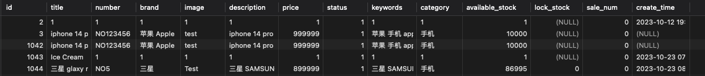
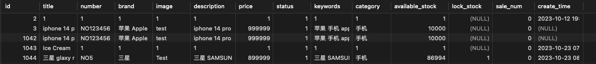
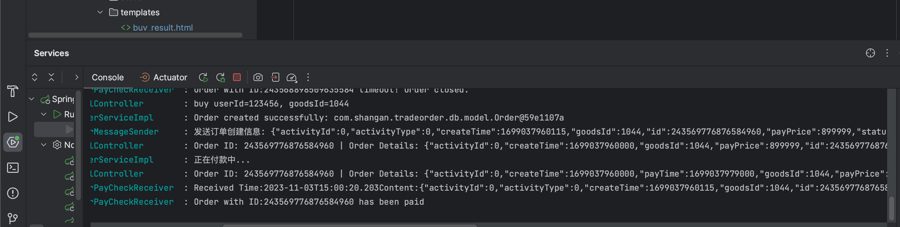
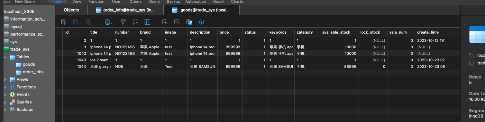

# trade-release

## Assignment for Class 7 
**Completion Date:** Nov 3

1. **RabbitMQ and Delay Message Test**:
  
   - **Installation**: We first installed RabbitMQ. You can visit the management UI in the browser at [http://localhost:15672/](http://localhost:15672/). Credentials: 
     - **Username:** guest
     - **Password:** guest
     
   - **Modifications**: Modify the modules for `trade-order` and `trade-web-portal`. Add the necessary dependencies in `pom.xml` and the configuration files. Finally add the @EnableRabbit annotation in the corresponding main start class. 

    - **Development of the timeout for unpaid orders**: First, we create a `RabbitMqConfig` class and then in `trade-order` module we create another two classes one for `OrderPayCheckReciver` and the other for `OrderMessageSender`. Finally, we write a `RabbitTestController` to deal with the test request and send the verify dealy request message:

    

  For the testing, I tried to send two message and we can check the message that store temporarily in the `order.delay.queue`:
  
  We can also verify this in the backend console:
  
  It can be shown that the received time is exactly one minutes(60000 miliseconds) after the sending time!

2. **Unpaid orders close logic development**:
In this part, we will send the status check message when creating our order hence modified the `OrderServiceImpl.java` and in the `OrderPayCheckReceiver`, we check the status of the consumed order and close the corresponding order that not being paid beyond one minutes, for testing we just create a new order in the path: `http://localhost:8098/goods/1044` (there is already a goods: 三星 glaxy note2 with id 1044 exists). Then after we click 'buy now' and wait for one miniutes we can see that the order closed since we havn't buy it in one minutes and the order status has changed to 99 indicating this:

We can also verify this in the console as follows:

3. **Inventory Deduction Code Development**:

In this part: we first modify the `GoodsMapper.xml` and add the sql operation for 'lockStock', 'deductStock' and 'revertStock'. Then, we modify the portalController with the @RequestMapping("buy/{userId}/{goodsId}") and modify the return value to be ModelAndView so that it will be resolved by Spring's view resolver to an actual veiw in the Thymeleaf template. Then after the logic for payment succesful and order closeing when timeout logic is implemented. We can verify the lock available_stock change and the lock_stock change correspondingly. We start with the product id 1044 with the title: "三星 galaxy note2" and avaialbe stock: start with: `86995`:

Then we can test things in two cases:
  - **Add order and unpay**: 
     - We tried to add the order and not pay it we can found that the available_stock deduct by 1 and lock_stock add by 1:
     
     After one minutes we can found that the lock_stock is released and the avaialbe_stock added back by 1:
     

  - **Add order and pay**:
    - This time if we just paid the order within one minute we can found: 
    Firstly in the console:
    

    And we can see that the lock_stock is released while the available stock decreaed by 1 and this means that the order decreaed correctly in the database correspondingly also successfully:
    
