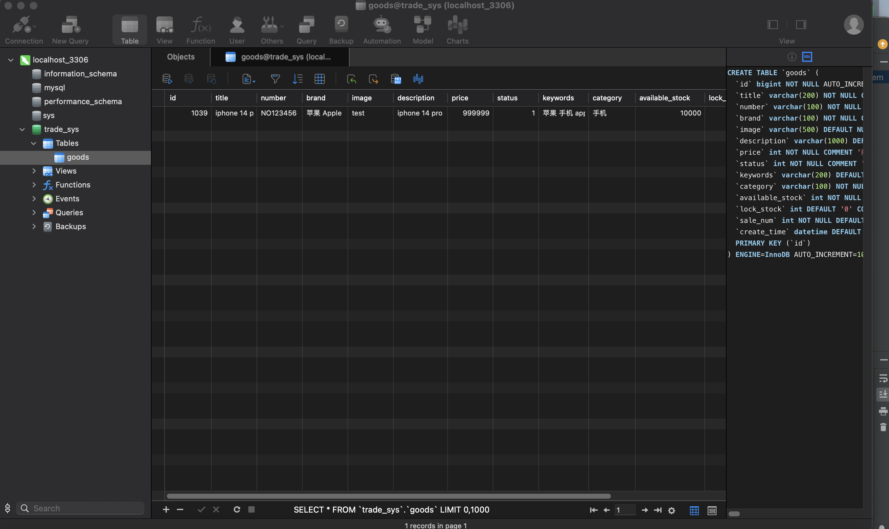

# trade-release

## Assignment 1, 2 (Complete Data: Oct 12)

1. **Software Configuration**:
   - I have already downloaded all the required software.
   - Git has been configured in my IntelliJ, as shown in the GitHub commit history.

2.  **Navicat Database establish**:

  

2. **CRUD Junit Test**:

     

---

## [3. Product Page] 

Crate backend management module establish the create product page and tried the test to add new product:

  

---

## [Product Detail Page]  

Create the frontend module and import the necessary frontend style files. Create the product detail page's controller and frontend.

- Product query Service
- Testing

 

Test "Buy Now" Button indeed send the request into the backend!

